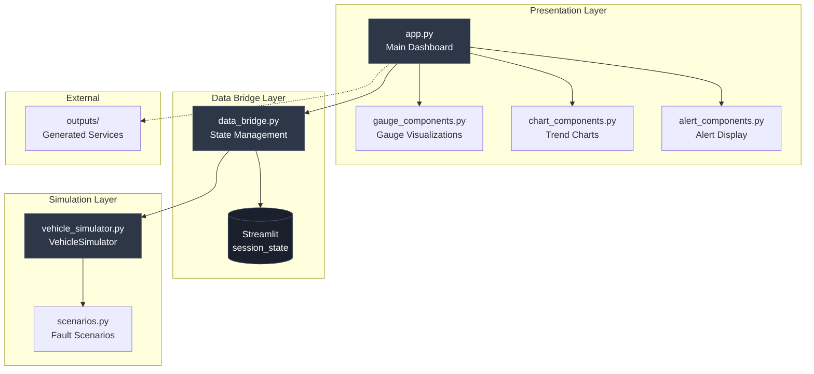

# Design Document: AutoForge Live Vehicle Dashboard

## Overview

The AutoForge Live Vehicle Dashboard is a real-time visualization system that demonstrates vehicle health monitoring capabilities through simulated Vehicle Signal Specification (VSS) compliant data. The system consists of three primary layers:

1. **Simulation Layer**: Generates realistic vehicle signals and applies fault scenarios
2. **Data Bridge Layer**: Manages state persistence and data flow between simulation and UI
3. **Presentation Layer**: Renders interactive visualizations using Streamlit and Plotly

The dashboard operates as a standalone demonstration tool while integrating with the broader AutoForge ecosystem by visualizing generated vehicle services from the outputs folder.

### Key Design Principles

- **Separation of Concerns**: Clear boundaries between simulation logic, state management, and UI rendering
- **Streamlit-Native State**: Leverage session_state for persistence across reruns
- **Dark Theme Consistency**: All visualizations use a unified dark theme (#0d1117 background)
- **Real-Time Updates**: Continuous refresh loop with configurable tick speed
- **Graceful Degradation**: Dashboard functions independently without generated code

## Architecture

### System Components



### Data Flow

1. **Initialization**: `data_bridge.initialize_simulator()` creates VehicleSimulator instance in session_state
2. **Tick Cycle**: `data_bridge.get_next_tick()` calls `simulator.tick()`, appends to history buffer
3. **Alert Generation**: `simulator.get_alert_status()` evaluates thresholds and returns Alert list
4. **Visualization**: Components read from history buffer and current state to render gauges/charts
5. **User Interaction**: Sidebar controls trigger scenario application or simulator reset

### File Structure

```
autoforge/
├── dashboard/
│   ├── __init__.py
│   ├── app.py                    # Main Streamlit application
│   ├── data_bridge.py            # State management and data flow
│   ├── gauge_components.py       # Gauge visualization components
│   ├── chart_components.py       # Trend chart components
│   ├── alert_components.py       # Alert display components
│   └── simulation/
│       ├── __init__.py
│       ├── vehicle_simulator.py  # VehicleSimulator class
│       └── scenarios.py          # Fault scenario definitions
├── outputs/                      # Generated services (optional)
└── run_dashboard.py              # Entry point script
```

## Components and Interfaces

### VehicleSimulator Class

**Responsibility**: Maintain and update simulated VSS signal values

**Interface**:
```python
class VehicleSimulator:
    def __init__(self, scenario: str = "normal"):
        """Initialize simulator with realistic starting values"""
        
    def tick(self) -> Dict[str, float]:
        """Update all signals and return current state as VSS-style dict"""
        
    def get_alert_status(self) -> List[Alert]:
        """Evaluate thresholds and return active alerts"""
        
    def trigger_scenario(self, scenario_name: str) -> None:
        """Apply a fault scenario to the simulator"""
        
    def reset(self) -> None:
        """Reset to normal operating mode"""
```

**State Variables**:
- `vehicle_speed`: float (0-200 kmh)
- `tyre_pressure_fl/fr/rl/rr`: float (150-350 kPa)
- `battery_soc`: float (0-100%)
- `ev_range`: float (0-500 km)
- `throttle_position`: float (0-100%)
- `brake_position`: float (0-100%)
- `gear_position`: int (0-8)
- `steering_angle`: float (-540 to 540 degrees)
- `motor_temperature`: float (20-120 C)
- `coolant_temperature`: float (20-110 C)
- `_scenario_state`: dict (tracks active scenario progress)
- `_tick_count`: int (tracks simulation time)

**Update Logic**:
- Normal mode: Random walk with signal-specific deltas
- Scenario mode: Deterministic progression toward target values
- Battery-range coupling: `ev_range = battery_soc * 5.0` (base formula)
- Gear adjustment: Higher gears reduce range consumption rate

### Scenarios Module

**Responsibility**: Define and apply fault scenarios

**Interface**:
```python
SCENARIOS: Dict[str, ScenarioDefinition] = {
    "tyre_puncture": {...},
    "low_battery": {...},
    "overheating": {...},
    "highway_cruise": {...},
    "city_driving": {...}
}

def apply_scenario(simulator: VehicleSimulator, scenario_name: str) -> None:
    """Apply scenario to simulator instance"""
```

**ScenarioDefinition Structure**:
```python
@dataclass
class ScenarioDefinition:
    name: str
    description: str
    signal_overrides: Dict[str, float]  # Immediate value changes
    signal_trends: Dict[str, Tuple[float, int]]  # (target_value, ticks_to_reach)
```

**Scenario Specifications**:
- `tyre_puncture`: Reduce tyre_pressure_fl from 220 to 80 kPa over 30 ticks
- `low_battery`: Triple battery_soc drain rate (0.15% per tick)
- `overheating`: Increase motor_temperature from 80 to 118 C over 20 ticks
- `highway_cruise`: Maintain vehicle_speed at 120 kmh (±2 kmh variation)
- `city_driving`: Oscillate vehicle_speed between 0-60 kmh with 15-tick period

### Data Bridge Module

**Responsibility**: Manage state persistence and data flow

**Interface**:
```python
def initialize_simulator(scenario: str = "normal") -> None:
    """Create or reset VehicleSimulator in session_state"""
    
def get_next_tick() -> Dict[str, float]:
    """Call simulator.tick(), append to history, return current state"""
    
def get_history() -> pd.DataFrame:
    """Return history buffer as DataFrame with timestamp column"""
    
def get_current_alerts() -> List[Alert]:
    """Return current alert list from simulator"""
    
def apply_scenario(scenario_name: str) -> None:
    """Trigger scenario on simulator"""
    
def reset_simulator() -> None:
    """Reinitialize simulator to normal mode"""
```

**Session State Keys**:
- `simulator`: VehicleSimulator instance
- `history`: List[Dict] (max 60 entries, FIFO)
- `tick_count`: int
- `start_time`: datetime

**History Buffer Management**:
- Maximum 60 ticks retained (rolling window)
- Each entry: `{timestamp: datetime, **signal_values}`
- Converted to pandas DataFrame for chart rendering

### Gauge Components Module

**Responsibility**: Render real-time signal gauges

**Interface**:
```python
def render_speedometer(speed: float) -> None:
    """Display vehicle speed gauge (0-200 kmh)"""
    
def render_tyre_pressure_gauge(pressure: float, position: str) -> None:
    """Display tyre pressure gauge (150-350 kPa)"""
    
def render_battery_gauge(soc: float) -> None:
    """Display battery state of charge as horizontal bar (0-100%)"""
    
def render_temperature_gauge(temp: float, label: str) -> None:
    """Display temperature gauge (20-120 C)"""
```

**Plotly Gauge Configuration**:
```python
GAUGE_THEME = {
    "paper_bgcolor": "#0d1117",
    "plot_bgcolor": "#0d1117",
    "font": {"color": "white"},
    "height": 200
}

SPEEDOMETER_RANGES = [
    {"range": [0, 80], "color": "green"},
    {"range": [80, 130], "color": "yellow"},
    {"range": [130, 200], "color": "red"}
]

TYRE_PRESSURE_RANGES = [
    {"range": [150, 180], "color": "red"},
    {"range": [180, 280], "color": "green"},
    {"range": [280, 350], "color": "yellow"}
]

BATTERY_RANGES = [
    {"range": [0, 20], "color": "red"},
    {"range": [20, 40], "color": "yellow"},
    {"range": [40, 100], "color": "green"}
]
```

### Chart Components Module

**Responsibility**: Render time-series trend charts

**Interface**:
```python
def render_tyre_pressure_trend(history_df: pd.DataFrame) -> None:
    """Display 4 tyre pressure lines with 180 kPa threshold"""
    
def render_battery_trend(history_df: pd.DataFrame) -> None:
    """Display battery_soc and ev_range on dual Y-axes as area chart"""
    
def render_speed_trend(history_df: pd.DataFrame) -> None:
    """Display vehicle speed line chart"""
    
def render_temperature_trend(history_df: pd.DataFrame) -> None:
    """Display motor and coolant temperature with warning thresholds"""
```

**Plotly Chart Configuration**:
```python
CHART_THEME = {
    "paper_bgcolor": "#0d1117",
    "plot_bgcolor": "#0d1117",
    "font": {"color": "white"},
    "height": 300,
    "xaxis": {"gridcolor": "#30363d"},
    "yaxis": {"gridcolor": "#30363d"}
}

THRESHOLD_LINE_STYLE = {
    "color": "red",
    "width": 2,
    "dash": "dash"
}
```

**Chart-Specific Details**:
- Tyre pressure: 4 traces (fl, fr, rl, rr) + horizontal line at 180 kPa
- Battery: Area chart with dual Y-axes (left: soc %, right: range km)
- Speed: Single line trace with X-axis as timestamp
- Temperature: 2 traces + horizontal lines at 100 C and 95 C

### Alert Components Module

**Responsibility**: Display alert notifications

**Interface**:
```python
def render_alert_panel(alerts: List[Alert]) -> None:
    """Display active alerts with severity-based styling"""
    
def render_alert_history_table(history_df: pd.DataFrame) -> None:
    """Display historical alerts as dataframe"""
```

**Alert Display Logic**:
- CRITICAL alerts: `st.error()` with red background
- WARNING alerts: `st.warning()` with yellow background
- Format: `[SEVERITY] Signal: value (threshold: X) - Message`

### Main Application (app.py)

**Responsibility**: Orchestrate dashboard layout and refresh loop

**Structure**:
```python
# Page configuration
st.set_page_config(
    page_title="AutoForge — Vehicle Health",
    layout="wide",
    initial_sidebar_state="expanded"
)

# Dark theme CSS injection
st.markdown(DARK_THEME_CSS, unsafe_allow_html=True)

# Header
render_header()

# Sidebar
with st.sidebar:
    render_scenario_controls()
    render_generated_services_list()

# Initialize simulator
if "simulator" not in st.session_state:
    initialize_simulator()

# Main content loop
while True:
    current_state = get_next_tick()
    alerts = get_current_alerts()
    history_df = get_history()
    
    # Alerts row
    render_alert_panel(alerts)
    
    # Gauges row (6 columns)
    col1, col2, col3, col4, col5, col6 = st.columns(6)
    with col1: render_speedometer(current_state["vehicle_speed"])
    with col2: render_tyre_pressure_gauge(current_state["tyre_pressure_fl"], "FL")
    # ... (remaining gauges)
    
    # Chart rows
    render_tyre_pressure_trend(history_df)
    render_battery_trend(history_df)
    render_speed_trend(history_df)
    render_temperature_trend(history_df)
    
    # Bottom tabs
    tab1, tab2, tab3 = st.tabs(["Raw Signals", "Alert Log", "Generated Code"])
    with tab1: st.dataframe(history_df)
    with tab2: render_alert_history_table(history_df)
    with tab3: render_generated_code_viewer()
    
    # Sleep based on tick speed slider
    time.sleep(st.session_state.get("tick_speed", 1.0))
    st.rerun()
```

## Data Models

### VSS Signal Dictionary

Signals are stored as a flat dictionary with VSS-style keys:

```python
SignalState = {
    "vehicle_speed": float,           # kmh
    "tyre_pressure_fl": float,        # kPa (front-left)
    "tyre_pressure_fr": float,        # kPa (front-right)
    "tyre_pressure_rl": float,        # kPa (rear-left)
    "tyre_pressure_rr": float,        # kPa (rear-right)
    "battery_soc": float,             # %
    "ev_range": float,                # km
    "throttle_position": float,       # %
    "brake_position": float,          # %
    "gear_position": int,             # 0-8
    "steering_angle": float,          # degrees
    "motor_temperature": float,       # C
    "coolant_temperature": float      # C
}
```

### Alert Data Model

```python
@dataclass
class Alert:
    signal_name: str
    current_value: float
    threshold_value: float
    severity: str  # "WARNING" or "CRITICAL"
    message: str
    timestamp: datetime
```

**Alert Threshold Rules**:
- Tyre pressure: WARNING < 180 kPa, CRITICAL < 150 kPa
- Battery SOC: WARNING < 20%, CRITICAL < 10%
- Motor temperature: WARNING > 100 C, CRITICAL > 115 C
- Coolant temperature: WARNING > 95 C, CRITICAL > 105 C

### History Buffer Data Model

```python
HistoryEntry = {
    "timestamp": datetime,
    **SignalState  # All signal values flattened
}

# Stored as List[HistoryEntry] in session_state
# Converted to pandas DataFrame for visualization
```

**Buffer Management**:
- Maximum 60 entries (FIFO)
- Timestamp generated at tick time
- DataFrame conversion adds index and sorts by timestamp

### Streamlit State Schema

```python
st.session_state = {
    "simulator": VehicleSimulator,
    "history": List[HistoryEntry],  # Max 60
    "tick_count": int,
    "start_time": datetime,
    "tick_speed": float,  # Seconds between ticks (from slider)
    "selected_scenario": str,  # From dropdown
    "alert_log": List[Alert]  # Cumulative alert history
}
```


## Correctness Properties

*A property is a characteristic or behavior that should hold true across all valid executions of a system—essentially, a formal statement about what the system should do. Properties serve as the bridge between human-readable specifications and machine-verifiable correctness guarantees.*

### Property 1: Signal State Initialization Bounds

*For any* scenario parameter, when a VehicleSimulator is initialized, all VSS signal values SHALL be within their defined valid ranges (vehicle_speed: 0-200, tyre_pressure: 150-350, battery_soc: 0-100, ev_range: 0-500, throttle_position: 0-100, brake_position: 0-100, gear_position: 0-8, steering_angle: -540 to 540, motor_temperature: 20-120, coolant_temperature: 20-110).

**Validates: Requirements 1.2**

### Property 2: Tick Returns Complete Signal Dictionary

*For any* VehicleSimulator state, when the tick method is called, the returned dictionary SHALL contain all 13 VSS signal keys with numeric values.

**Validates: Requirements 1.3**

### Property 3: Normal Mode Bounded Updates

*For any* VehicleSimulator in normal mode, after one tick, the change in vehicle_speed SHALL be at most ±5 kmh, the change in any tyre_pressure SHALL be at most ±1 kPa, and the change in battery_soc SHALL be at most 0.05%.

**Validates: Requirements 1.4**

### Property 4: Battery-Range Proportional Relationship

*For any* VehicleSimulator state, the ev_range value SHALL maintain a proportional relationship to battery_soc (base formula: ev_range ≈ battery_soc * 5.0, with adjustments for gear and speed).

**Validates: Requirements 1.5**

### Property 5: Gear and Speed Affect Range Calculation

*For any* VehicleSimulator state, when gear_position or vehicle_speed changes, the ev_range calculation SHALL reflect the change (higher gears and speeds reduce effective range per SOC unit).

**Validates: Requirements 1.6**

### Property 6: Alert Threshold Detection

*For any* VehicleSimulator state, when a signal crosses a defined threshold (tyre_pressure < 180 kPa or < 150 kPa, battery_soc < 20% or < 10%, motor_temperature > 100 C or > 115 C, coolant_temperature > 95 C or > 105 C), an Alert with the correct severity (WARNING or CRITICAL) SHALL be generated.

**Validates: Requirements 3.2, 3.3, 3.4, 3.5, 3.6, 3.7, 3.8, 3.9**

### Property 7: Alert Structure Completeness

*For any* Alert generated by the VehicleSimulator, the Alert object SHALL contain signal_name, current_value, threshold_value, severity, message, and timestamp fields.

**Validates: Requirements 3.10**

### Property 8: History Buffer Bounded Growth

*For any* number of ticks N, after calling get_next_tick N times, the history buffer SHALL contain min(N, 60) entries, maintaining a FIFO rolling window.

**Validates: Requirements 4.3, 4.4**

### Property 9: Chart Display Window Limit

*For any* history buffer state, trend charts SHALL display at most 60 data points, corresponding to the rolling window size.

**Validates: Requirements 6.7**

### Property 10: Scenario Determinism

*For any* scenario and initial state, applying the same scenario twice with the same random seed SHALL produce identical signal progressions over the same number of ticks.

**Validates: Requirements 11.1, 11.3**

## Error Handling

### Simulation Layer Errors

**Invalid Signal Values**:
- Signals are clamped to valid ranges during updates
- Example: tyre_pressure cannot go below 0 or above 400 kPa
- Clamping prevents unrealistic values while allowing fault scenarios to push boundaries

**Unknown Scenario Names**:
- `trigger_scenario()` raises `ValueError` if scenario_name not in SCENARIOS dictionary
- Error message includes list of valid scenario names
- Simulator state remains unchanged on error

**Initialization Failures**:
- If scenario parameter is invalid, fall back to "normal" mode
- Log warning but continue execution

### Data Bridge Layer Errors

**Session State Corruption**:
- If session_state lacks required keys, reinitialize simulator
- Graceful recovery prevents dashboard crashes on browser refresh

**History Buffer Overflow**:
- Automatic FIFO eviction when buffer exceeds 60 entries
- No error raised, oldest entries silently dropped

**DataFrame Conversion Failures**:
- If history is empty, return empty DataFrame with correct schema
- Prevents chart rendering errors on first tick

### Presentation Layer Errors

**Missing Generated Services**:
- Check if outputs folder exists before listing contents
- Display "No generated services available" message if empty
- Dashboard continues to function with simulation features

**Plotly Rendering Failures**:
- Wrap chart rendering in try-except blocks
- Display error message in place of chart on failure
- Log error details for debugging

**Invalid Gauge Values**:
- Clamp values to gauge ranges before rendering
- Example: Speed gauge shows 200 kmh if value exceeds maximum
- Prevents Plotly errors from out-of-range values

### Entry Point Errors

**Missing Dependencies**:
- `run_dashboard.py` checks for streamlit installation
- If not found, print installation command: `pip install -r requirements.txt`
- Exit with code 1 and clear error message

**File Not Found**:
- If `autoforge/dashboard/app.py` doesn't exist, print error
- Suggest running from project root directory
- Exit with code 1

## Testing Strategy

### Dual Testing Approach

This feature requires both unit tests and property-based tests for comprehensive coverage:

- **Unit tests**: Verify specific examples, edge cases, and error conditions
- **Property tests**: Verify universal properties across all inputs

Together, these approaches provide comprehensive coverage where unit tests catch concrete bugs and property tests verify general correctness.

### Property-Based Testing Configuration

**Library Selection**: Use `hypothesis` for Python property-based testing

**Test Configuration**:
- Minimum 100 iterations per property test (due to randomization)
- Each property test references its design document property
- Tag format: `# Feature: autoforge-live-dashboard, Property {number}: {property_text}`

**Property Test Implementation**:
- Each correctness property (1-10) SHALL be implemented by a SINGLE property-based test
- Tests use Hypothesis strategies to generate random inputs
- Example strategy: `@given(speed=floats(min_value=0, max_value=200))`

### Unit Testing Focus

**Specific Examples**:
- Test that simulator maintains all 13 required signal keys (Property 1)
- Test tyre_puncture scenario reduces pressure to ~80 kPa after 30 ticks (Requirement 2.2)
- Test low_battery scenario triples drain rate (Requirement 2.3)
- Test overheating scenario reaches ~118 C after 20 ticks (Requirement 2.4)
- Test highway_cruise maintains speed near 120 kmh (Requirement 2.5)
- Test city_driving oscillates between 0-60 kmh (Requirement 2.6)

**Edge Cases**:
- Battery SOC at exactly 20%, 10% (boundary conditions for alerts)
- Tyre pressure at exactly 180 kPa, 150 kPa (boundary conditions)
- Temperature at exactly 100 C, 115 C, 95 C, 105 C (boundaries)
- History buffer at exactly 60 entries (maximum capacity)
- Empty history buffer (first tick)

**Error Conditions**:
- Invalid scenario name passed to trigger_scenario
- Missing session_state keys in data_bridge
- Empty outputs folder (graceful degradation)
- Missing streamlit dependency in run_dashboard.py

**Integration Points**:
- Data bridge correctly initializes simulator in session_state
- Gauge components render without error for valid signal values
- Chart components handle empty history DataFrames
- Alert panel displays both WARNING and CRITICAL alerts correctly

### Test File Organization

```
tests/
├── unit/
│   ├── test_vehicle_simulator.py      # VehicleSimulator unit tests
│   ├── test_scenarios.py               # Scenario application tests
│   ├── test_data_bridge.py             # Data bridge unit tests
│   ├── test_gauge_components.py        # Gauge rendering tests
│   ├── test_chart_components.py        # Chart rendering tests
│   └── test_alert_components.py        # Alert display tests
├── property/
│   ├── test_simulator_properties.py    # Properties 1-5, 10
│   ├── test_alert_properties.py        # Properties 6-7
│   └── test_history_properties.py      # Properties 8-9
└── integration/
    └── test_dashboard_integration.py   # End-to-end dashboard tests
```

### Mock Strategy

**Streamlit Mocking**:
- Mock `st.session_state` as a dictionary for data_bridge tests
- Mock `st.plotly_chart` to verify chart rendering calls
- Mock `st.error` and `st.warning` to verify alert display

**File System Mocking**:
- Mock `os.path.exists` for outputs folder checks
- Mock `os.listdir` for generated services listing

**Time Mocking**:
- Mock `datetime.now()` for deterministic timestamp testing
- Mock `time.sleep()` to speed up integration tests

### Coverage Goals

- Simulation layer: 95% line coverage
- Data bridge layer: 90% line coverage
- Component layer: 80% line coverage (UI code harder to test)
- Overall: 85% line coverage minimum

### Continuous Testing

- Run unit tests on every commit (fast feedback)
- Run property tests on pull requests (comprehensive validation)
- Run integration tests nightly (catch environment-specific issues)
