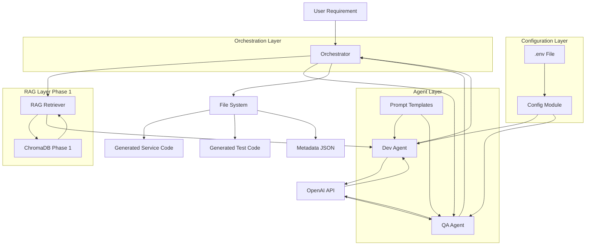

# Design Document: AutoForge Multi-Agent Code Generation System

## Overview

The AutoForge Multi-Agent Code Generation System (Phase 2) extends the Phase 1 RAG knowledge base with an LLM-powered orchestration pipeline that automatically generates MISRA-compliant C++ automotive services and corresponding test code from natural language requirements. The system employs a multi-agent architecture where specialized AI agents (Dev Agent and QA Agent) collaborate under an orchestrator to produce production-ready code with built-in safety compliance and automated testing.

The design leverages OpenAI's GPT models for code generation while using the Phase 1 RAG system to inject automotive domain knowledge (VSS signals, MISRA rules, ASPICE guidelines) into generation prompts. This hybrid approach combines the reasoning capabilities of large language models with the precision of domain-specific knowledge retrieval, enabling rapid prototyping of Software Defined Vehicle (SDV) components that adhere to automotive industry standards.

Key design principles:
- **Agent Specialization**: Separate agents for production code and test code generation with distinct prompt templates
- **Graceful Degradation**: System saves partial results if test generation fails, preventing loss of generated service code
- **Traceability**: Metadata tracking for requirements, VSS signals used, timestamps, and model versions
- **Extensibility**: Template-based prompts allow prompt engineering without code changes
- **Safety-First**: MISRA compliance enforced through prompt instructions and RAG context injection

## Architecture

The system follows a four-layer architecture that extends Phase 1's RAG foundation:

1. **Configuration Layer**: Environment-based settings management for API keys, model selection, and paths
2. **Agent Layer**: Specialized AI agents (Dev Agent, QA Agent) that generate code using LLM APIs and RAG context
3. **Orchestration Layer**: Workflow coordinator that manages agent execution, file I/O, and error handling
4. **Interface Layer**: Interactive and demo modes for user interaction



The architecture ensures clear separation of concerns: configuration is centralized, agents are stateless and reusable, orchestration handles workflow complexity, and the RAG layer provides domain knowledge without coupling to code generation logic.

## Components and Interfaces

### Configuration Module (`autoforge/config.py`)

**Responsibilities:**
- Load environment variables from .env file using python-dotenv
- Provide centralized access to system settings (API keys, model names, paths)
- Initialize and return OpenAI client instances
- Validate configuration at startup

**Key Functions:**

```python
def load_config() -> Dict[str, Any]:
    """Load configuration from environment variables
    
    Returns:
        {
            'llm_provider': str,
            'openai_api_key': str,
            'model_name': str,
            'max_tokens': int,
            'chroma_db_path': Path,
            'outputs_dir': Path
        }
    """

def get_llm_client() -> OpenAI:
    """Initialize and return OpenAI client instance
    
    Raises:
        ValueError: If OPENAI_API_KEY is not set
        FileNotFoundError: If CHROMA_DB_PATH does not exist
    """

def validate_config(config: Dict[str, Any]) -> None:
    """Validate configuration values
    
    Raises:
        ValueError: If MODEL_NAME is empty or MAX_TOKENS is not positive
    """
```

**Interface Contract:**
- Input: Environment variables from .env file
- Output: Configuration dictionary and OpenAI client instance
- Side Effects: Raises exceptions for missing or invalid configuration

**Configuration Schema:**
```python
{
    'LLM_PROVIDER': 'openai',  # Default
    'OPENAI_API_KEY': '<from_env>',  # Required
    'MODEL_NAME': 'gpt-4o-mini',  # Default
    'MAX_TOKENS': 2048,  # Default
    'CHROMA_DB_PATH': 'autoforge/data/chroma_db',  # Default
    'OUTPUTS_DIR': 'autoforge/outputs'  # Default
}
```

### Dev Agent (`autoforge/agents/dev_agent.py`)

**Responsibilities:**
- Generate MISRA-compliant C++ service code from natural language requirements
- Retrieve automotive context from RAG system
- Load and fill prompt templates with requirement and RAG context
- Parse LLM responses to extract C++ code
- Derive service names from requirements
- Extract VSS signal usage from generated code

**Key Functions:**

```python
class DevAgent:
    def __init__(self, llm_client: OpenAI, rag_retriever: RAGRetriever, 
                 prompt_template_path: Path, model_name: str, max_tokens: int):
        """Initialize Dev Agent with LLM client and RAG retriever"""
    
    def generate(self, requirement: str) -> Dict[str, Any]:
        """Generate C++ service code from requirement
        
        Args:
            requirement: Natural language requirement string
            
        Returns:
            {
                'service_name': str,  # snake_case derived name
                'header_code': str,  # .h file content
                'source_code': str,  # .cpp file content
                'full_code': str,  # combined code
                'requirement': str,  # original requirement
                'vss_signals_used': List[str]  # extracted VSS signals
            }
            
        Raises:
            FileNotFoundError: If prompt template is missing
            Exception: If OpenAI API call fails
        """
    
    def _load_prompt_template(self) -> str:
        """Load prompt template from file with UTF-8 encoding"""
    
    def _fill_prompt_template(self, template: str, requirement: str, 
                             rag_context: Dict[str, List[str]]) -> str:
        """Fill template placeholders with requirement and RAG context"""
    
    def _derive_service_name(self, requirement: str) -> str:
        """Derive snake_case service name from requirement
        
        Extracts first 3-4 meaningful words, excludes stop words
        """
    
    def _extract_vss_signals(self, code: str) -> List[str]:
        """Extract VSS signal references from generated code
        
        Searches for 'Vehicle.' pattern occurrences
        """
    
    def _parse_llm_response(self, response: str) -> str:
        """Parse LLM response to extract C++ code
        
        Handles markdown code blocks and raw code
        """
```

**Interface Contract:**
- Input: Natural language requirement string
- Output: Dictionary containing service name, code, and metadata
- Side Effects: Prints progress messages, makes OpenAI API calls

**Prompt Template Structure (`prompts/dev_agent_prompt.txt`):**
```
You are a senior automotive embedded software engineer specializing in C++ development for Software Defined Vehicles (SDV).

REQUIREMENT:
{requirement}

VSS SIGNALS CONTEXT:
{vss_context}

MISRA-C++ RULES CONTEXT:
{misra_context}

ASPICE GUIDELINES CONTEXT:
{aspice_context}

INSTRUCTIONS:
1. Generate a self-contained C++ service with .h and .cpp files
2. Use ONLY VSS signals provided in the context
3. Comply with MISRA rules and add inline comments: // MISRA Rule X.X: [reason]
4. Class structure: constructor, init(), process(map<string,float>), getAlerts()
5. Validate signals against VSS min/max ranges
6. Include file headers with service name, requirement, MISRA compliance statement, and "generated by AutoForge"
7. Return ONLY raw C++ code without markdown formatting

OUTPUT FORMAT:
// Header file (.h)
[header code]

// Source file (.cpp)
[source code]
```

### QA Agent (`autoforge/agents/qa_agent.py`)

**Responsibilities:**
- Generate C++ test code for generated services
- Create test cases for normal, boundary, out-of-range, and missing signal scenarios
- Generate MockDataProvider classes for test data
- Parse LLM responses to extract test code

**Key Functions:**

```python
class QAAgent:
    def __init__(self, llm_client: OpenAI, prompt_template_path: Path, 
                 model_name: str, max_tokens: int):
        """Initialize QA Agent with LLM client"""
    
    def generate_tests(self, requirement: str, generated_code: str, 
                      service_name: str) -> Dict[str, Any]:
        """Generate test code for service
        
        Args:
            requirement: Original requirement string
            generated_code: Generated service code from Dev Agent
            service_name: Service name in snake_case
            
        Returns:
            {
                'test_code': str,  # Complete test file content
                'service_name': str,
                'test_file_name': str  # Format: test_[service_name].cpp
            }
            
        Raises:
            FileNotFoundError: If prompt template is missing
            Exception: If OpenAI API call fails
        """
    
    def _load_prompt_template(self) -> str:
        """Load prompt template from file with UTF-8 encoding"""
    
    def _fill_prompt_template(self, template: str, requirement: str, 
                             generated_code: str, service_name: str) -> str:
        """Fill template placeholders"""
    
    def _parse_llm_response(self, response: str) -> str:
        """Parse LLM response to extract C++ test code"""
```

**Interface Contract:**
- Input: Requirement, generated service code, service name
- Output: Dictionary containing test code and metadata
- Side Effects: Prints progress messages, makes OpenAI API calls

**Prompt Template Structure (`prompts/qa_agent_prompt.txt`):**
```
You are an automotive QA engineer specializing in C++ testing for embedded systems.

REQUIREMENT:
{requirement}

GENERATED SERVICE CODE:
{generated_code}

SERVICE NAME:
{service_name}

INSTRUCTIONS:
1. Generate C++ test file using simple mock approach (no external frameworks)
2. Include main() function with assert statements
3. Test cases: normal values, boundary values, out-of-range values, missing signals
4. Print statements: "PASS: [test name]" or "FAIL: [test name]"
5. Include MockDataProvider class for test data
6. Return ONLY raw C++ code without markdown formatting

OUTPUT FORMAT:
[Complete test file with includes, MockDataProvider, test functions, and main()]
```

### Orchestrator (`autoforge/orchestrator.py`)

**Responsibilities:**
- Coordinate Dev Agent and QA Agent execution
- Manage file system operations (directory creation, file writing)
- Handle graceful degradation when QA Agent fails
- Generate and persist metadata
- Provide interactive and demo modes

**Key Functions:**

```python
class AutoForgeOrchestrator:
    def __init__(self, config: Dict[str, Any]):
        """Initialize orchestrator with configuration
        
        Creates RAGRetriever, DevAgent, and QAAgent instances
        """
    
    def run(self, requirement: str) -> Dict[str, Any]:
        """Execute complete code generation workflow
        
        Args:
            requirement: Natural language requirement string
            
        Returns:
            {
                'service_name': str,
                'code_file_path': Path,
                'test_file_path': Path,
                'metadata_file_path': Path,
                'dev_agent_output': Dict,
                'qa_agent_output': Dict,
                'error': Optional[str]  # Set if QA Agent fails
            }
            
        Workflow:
        1. Derive service_name from requirement
        2. Create output directory: outputs/[service_name]/
        3. Call DevAgent.generate(requirement)
        4. Save service code to [service_name].cpp
        5. Call QAAgent.generate_tests(requirement, code, service_name)
        6. Save test code to test_[service_name].cpp
        7. Save metadata.json with requirement, signals, timestamp, model
        8. Print summary with file paths
        
        Error Handling:
        - If QA Agent fails, save service code and metadata, log error, continue
        """
    
    def run_interactive(self) -> None:
        """Run interactive mode with continuous requirement input
        
        Loop:
        1. Display welcome message
        2. Prompt for requirement
        3. If 'quit' or 'exit', terminate
        4. Call run(requirement)
        5. Handle errors gracefully, continue loop
        """
    
    def _create_output_directory(self, service_name: str) -> Path:
        """Create output directory with parents=True, exist_ok=True"""
    
    def _save_code_file(self, file_path: Path, content: str) -> None:
        """Save code file with UTF-8 encoding"""
    
    def _save_metadata(self, output_dir: Path, metadata: Dict[str, Any]) -> Path:
        """Save metadata.json with indentation for readability"""
    
    def _print_summary(self, service_name: str, code_path: Path, 
                      test_path: Path, metadata_path: Path) -> None:
        """Print generation summary with emoji indicators"""
```

**Interface Contract:**
- Input: Natural language requirement string
- Output: Dictionary with file paths and generation results
- Side Effects: Creates directories, writes files, prints progress messages

**Metadata Schema:**
```json
{
  "requirement": "Create a tyre pressure monitoring service...",
  "service_name": "tyre_pressure_monitoring",
  "vss_signals_used": [
    "Vehicle.Chassis.Axle.Row1.Wheel.Left.Tire.Pressure",
    "Vehicle.Chassis.Axle.Row1.Wheel.Right.Tire.Pressure"
  ],
  "timestamp": "2024-01-15T10:30:45.123456",
  "model_used": "gpt-4o-mini"
}
```

### Entry Point Script (`run_phase2.py`)

**Responsibilities:**
- Provide command-line interface for demo and interactive modes
- Parse command-line arguments
- Initialize orchestrator and execute workflows

**Key Functions:**

```python
def main():
    """Main entry point
    
    Command-line arguments:
    --demo: Run demo mode with preset requirements
    
    Demo mode requirements:
    1. "Create a tyre pressure monitoring service that alerts when pressure drops below 28 PSI on any wheel"
    2. "Create a battery state of charge service that monitors EV range and triggers low battery warnings below 20%"
    
    Without --demo: Run interactive mode
    """
```

**Interface Contract:**
- Input: Command-line arguments
- Output: Generated code files in outputs/ directory
- Side Effects: Executes orchestrator workflows

## Data Models

### Configuration Data Model

```python
@dataclass
class Config:
    llm_provider: str = "openai"
    openai_api_key: str  # Required from environment
    model_name: str = "gpt-4o-mini"
    max_tokens: int = 2048
    chroma_db_path: Path = Path("autoforge/data/chroma_db")
    outputs_dir: Path = Path("autoforge/outputs")
```

### Dev Agent Output Model

```python
{
    'service_name': str,  # Example: "tyre_pressure_monitoring"
    'header_code': str,  # .h file content
    'source_code': str,  # .cpp file content
    'full_code': str,  # Combined header + source
    'requirement': str,  # Original requirement
    'vss_signals_used': List[str]  # Example: ["Vehicle.Chassis.Axle.Row1.Wheel.Left.Tire.Pressure"]
}
```

### QA Agent Output Model

```python
{
    'test_code': str,  # Complete test file content
    'service_name': str,  # Example: "tyre_pressure_monitoring"
    'test_file_name': str  # Example: "test_tyre_pressure_monitoring.cpp"
}
```

### Orchestrator Output Model

```python
{
    'service_name': str,
    'code_file_path': Path,  # Example: outputs/tyre_pressure_monitoring/tyre_pressure_monitoring.cpp
    'test_file_path': Path,  # Example: outputs/tyre_pressure_monitoring/test_tyre_pressure_monitoring.cpp
    'metadata_file_path': Path,  # Example: outputs/tyre_pressure_monitoring/metadata.json
    'dev_agent_output': Dict,  # Dev Agent output model
    'qa_agent_output': Dict,  # QA Agent output model
    'error': Optional[str]  # Set if QA Agent fails, None otherwise
}
```

### Metadata File Model

```python
{
    'requirement': str,  # Original natural language requirement
    'service_name': str,  # Derived snake_case name
    'vss_signals_used': List[str],  # VSS signals referenced in code
    'timestamp': str,  # ISO 8601 format: "2024-01-15T10:30:45.123456"
    'model_used': str  # Example: "gpt-4o-mini"
}
```

### Service Name Derivation Rules

**Algorithm:**
1. Tokenize requirement into words
2. Filter out stop words: ["create", "a", "an", "the", "that", "when", "which", "who", "where", "why", "how"]
3. Extract first 3-4 meaningful words
4. Convert to lowercase
5. Replace spaces with underscores
6. Remove special characters except underscores

**Examples:**
- "Create a tyre pressure monitoring service..." → "tyre_pressure_monitoring"
- "Create a battery state of charge service..." → "battery_state_charge"
- "Generate speed limit warning system" → "speed_limit_warning"

### VSS Signal Extraction Pattern

**Pattern:** `Vehicle\.[A-Za-z0-9.]+`

**Examples:**
- `Vehicle.Speed` → Extracted
- `Vehicle.Chassis.Axle.Row1.Wheel.Left.Tire.Pressure` → Extracted
- `Vehicle.Powertrain.TractionBattery.StateOfCharge.Current` → Extracted

**Algorithm:**
1. Use regex to find all matches of pattern in generated code
2. Deduplicate matches
3. Return sorted list of unique signal names


## Correctness Properties

A property is a characteristic or behavior that should hold true across all valid executions of a system—essentially, a formal statement about what the system should do. Properties serve as the bridge between human-readable specifications and machine-verifiable correctness guarantees.

### Property 1: Service Name Format Compliance

For any requirement string, the derived service_name must contain only lowercase letters, numbers, and underscores, and must be derived from the first 3-4 meaningful words (excluding stop words like "create", "a", "the", "that", "when") converted to snake_case format.

**Validates: Requirements 12.1, 12.2, 12.3, 12.4**

### Property 2: Dev Agent Output Structure Completeness

For any requirement string passed to DevAgent.generate(), the returned dictionary must contain exactly the keys: service_name, header_code, source_code, full_code, requirement, and vss_signals_used, with all values being non-null.

**Validates: Requirements 4.7**

### Property 3: QA Agent Output Structure Completeness

For any valid inputs passed to QAAgent.generate_tests(), the returned dictionary must contain exactly the keys: test_code, service_name, and test_file_name, with all values being non-null.

**Validates: Requirements 5.4**

### Property 4: Test Filename Format

For any service_name, the QA Agent must format the test_file_name as "test_[service_name].cpp".

**Validates: Requirements 5.5**

### Property 5: Orchestrator Output Structure Completeness

For any requirement string passed to Orchestrator.run(), the returned dictionary must contain the keys: service_name, code_file_path, test_file_path, metadata_file_path, dev_agent_output, qa_agent_output, and optionally error (if QA Agent fails).

**Validates: Requirements 6.11**


### Property 6: VSS Signal Extraction Correctness

For any generated C++ code containing VSS signal references matching the pattern "Vehicle\.[A-Za-z0-9.]+", the Dev Agent must extract all unique signal names and include them in the vss_signals_used list with no duplicates.

**Validates: Requirements 13.2, 13.3**

### Property 7: Metadata Field Completeness

For any generated service, the metadata.json file must contain all required fields: requirement (string), service_name (string), vss_signals_used (list), timestamp (ISO 8601 format string), and model_used (string).

**Validates: Requirements 14.2, 14.3, 14.4, 14.5, 14.6**

### Property 8: Metadata JSON Formatting

For any generated metadata.json file, the file must be formatted with indentation (not minified) for human readability.

**Validates: Requirements 14.7**

### Property 9: Code File Round-Trip Integrity

For any generated C++ code, when the code is saved to a file with UTF-8 encoding and then read back with UTF-8 encoding, the loaded content must match the original generated code exactly (byte-for-byte equality).

**Validates: Requirements 20.1, 20.3, 20.4**

### Property 10: Metadata Round-Trip Integrity

For any generated metadata dictionary, when the metadata is serialized to JSON and then parsed back, the parsed data must contain all original fields with values equal to the original values.

**Validates: Requirements 20.2**

### Property 11: LLM Response Whitespace Normalization

For any LLM response string, when parsed by Dev Agent or QA Agent, the resulting code must have leading and trailing whitespace stripped.

**Validates: Requirements 15.3**


### Property 12: Parsing Consistency Between Agents

For any LLM response string, when parsed by both Dev Agent and QA Agent using their respective _parse_llm_response methods, both agents must apply the same parsing logic (handling markdown code blocks, raw code, and whitespace stripping).

**Validates: Requirements 15.4**

### Property 13: Template Placeholder Replacement Completeness

For any prompt template with placeholder variables (e.g., {requirement}, {vss_context}), when filled with actual values, all placeholder occurrences must be replaced with their corresponding values, leaving no unreplaced placeholders in the final prompt.

**Validates: Requirements 19.5**

### Property 14: Error Message Preservation

For any exception raised due to OpenAI API call failures, the raised exception message must include the original error message from the API, preserving error details for debugging.

**Validates: Requirements 10.6**

### Property 15: Service Name Consistency

For any generated service, the derived service_name must be used consistently across directory names (outputs/[service_name]/), code file names ([service_name].cpp), test file names (test_[service_name].cpp), and metadata (service_name field).

**Validates: Requirements 12.5**


## Error Handling

### Configuration Errors

**Scenario:** Missing or invalid configuration values
**Handling:**
- Check OPENAI_API_KEY exists in environment before initializing client
- Raise ValueError with message "OPENAI_API_KEY environment variable is not set" if missing
- Validate CHROMA_DB_PATH directory exists, raise FileNotFoundError if missing
- Validate MODEL_NAME is non-empty string, raise ValueError if empty
- Validate MAX_TOKENS is positive integer, raise ValueError if not positive

**Example:**
```python
def get_llm_client() -> OpenAI:
    api_key = os.getenv('OPENAI_API_KEY')
    if not api_key:
        raise ValueError("OPENAI_API_KEY environment variable is not set")
    
    chroma_path = Path(os.getenv('CHROMA_DB_PATH', 'autoforge/data/chroma_db'))
    if not chroma_path.exists():
        raise FileNotFoundError(f"RAG database not initialized at {chroma_path}")
    
    return OpenAI(api_key=api_key)
```

### Prompt Template Errors

**Scenario:** Prompt template files are missing or have missing placeholders
**Handling:**
- Verify template file exists during agent initialization
- Raise FileNotFoundError with expected file path if missing
- Read templates with UTF-8 encoding to handle special characters
- Raise KeyError if placeholder variable is not provided during template filling

**Example:**
```python
def _load_prompt_template(self) -> str:
    if not self.prompt_template_path.exists():
        raise FileNotFoundError(f"Prompt template not found: {self.prompt_template_path}")
    
    with open(self.prompt_template_path, 'r', encoding='utf-8') as f:
        return f.read()

def _fill_prompt_template(self, template: str, **kwargs) -> str:
    try:
        return template.format(**kwargs)
    except KeyError as e:
        raise KeyError(f"Missing placeholder variable in template: {e}")
```


### OpenAI API Errors

**Scenario:** LLM API calls fail due to authentication, rate limits, or network issues
**Handling:**
- Wrap all OpenAI API calls in try-except blocks
- Catch authentication errors and raise exception indicating invalid/missing API key
- Catch rate limit errors and raise exception indicating rate limit exceeded
- Catch network errors and raise exception indicating connection failure
- Include original error message in all raised exceptions for debugging

**Example:**
```python
def generate(self, requirement: str) -> Dict[str, Any]:
    try:
        response = self.llm_client.chat.completions.create(
            model=self.model_name,
            messages=[{"role": "user", "content": prompt}],
            max_tokens=self.max_tokens
        )
    except openai.AuthenticationError as e:
        raise Exception(f"OpenAI authentication failed: Invalid or missing API key. {e}")
    except openai.RateLimitError as e:
        raise Exception(f"OpenAI rate limit exceeded: {e}")
    except openai.APIConnectionError as e:
        raise Exception(f"OpenAI connection failed: {e}")
    except Exception as e:
        raise Exception(f"OpenAI API call failed: {e}")
```

### File System Errors

**Scenario:** Directory creation or file write operations fail
**Handling:**
- Use Path.mkdir with parents=True and exist_ok=True to handle existing directories
- Ensure parent directory exists before writing files
- Catch permission errors and provide clear error messages
- Use UTF-8 encoding for all file operations to preserve special characters

**Example:**
```python
def _create_output_directory(self, service_name: str) -> Path:
    output_dir = self.outputs_dir / service_name
    try:
        output_dir.mkdir(parents=True, exist_ok=True)
    except PermissionError as e:
        raise PermissionError(f"Cannot create directory {output_dir}: {e}")
    return output_dir

def _save_code_file(self, file_path: Path, content: str) -> None:
    try:
        file_path.parent.mkdir(parents=True, exist_ok=True)
        with open(file_path, 'w', encoding='utf-8') as f:
            f.write(content)
    except Exception as e:
        raise Exception(f"Failed to save file {file_path}: {e}")
```


### Graceful Degradation

**Scenario:** QA Agent fails during test generation
**Handling:**
- Catch exceptions from QA Agent in Orchestrator
- Save generated service code from Dev Agent (don't lose work)
- Save metadata.json with available information
- Log error message to console for visibility
- Include error field in returned dictionary
- Do NOT raise exception that terminates run method
- Allow workflow to complete partially

**Example:**
```python
def run(self, requirement: str) -> Dict[str, Any]:
    # ... Dev Agent generation succeeds ...
    
    qa_output = None
    error_message = None
    
    try:
        qa_output = self.qa_agent.generate_tests(requirement, dev_output['full_code'], service_name)
        test_file_path = output_dir / qa_output['test_file_name']
        self._save_code_file(test_file_path, qa_output['test_code'])
    except Exception as e:
        error_message = f"QA Agent failed: {e}"
        print(f"⚠️  {error_message}")
        print("✅ Service code saved successfully despite test generation failure")
    
    # Save metadata regardless of QA Agent success
    metadata = {
        'requirement': requirement,
        'service_name': service_name,
        'vss_signals_used': dev_output['vss_signals_used'],
        'timestamp': datetime.now().isoformat(),
        'model_used': self.model_name
    }
    metadata_path = self._save_metadata(output_dir, metadata)
    
    return {
        'service_name': service_name,
        'code_file_path': code_file_path,
        'test_file_path': test_file_path if qa_output else None,
        'metadata_file_path': metadata_path,
        'dev_agent_output': dev_output,
        'qa_agent_output': qa_output,
        'error': error_message
    }
```

### LLM Response Parsing Errors

**Scenario:** LLM returns unexpected response format
**Handling:**
- Handle both markdown code blocks (```cpp) and raw code
- Strip leading/trailing whitespace
- Extract and concatenate multiple code blocks if present
- Return empty string if no code found (let caller handle validation)

**Example:**
```python
def _parse_llm_response(self, response: str) -> str:
    # Try to extract markdown code blocks
    code_blocks = re.findall(r'```(?:cpp)?\n(.*?)```', response, re.DOTALL)
    
    if code_blocks:
        # Concatenate all code blocks
        return '\n\n'.join(block.strip() for block in code_blocks)
    
    # No markdown blocks, treat entire response as code
    return response.strip()
```


## Testing Strategy

### Dual Testing Approach

The testing strategy employs both unit tests and property-based tests to ensure comprehensive coverage:

- **Unit tests** verify specific examples, edge cases, error conditions, and integration points between components. They focus on concrete scenarios like specific configuration values, error messages, and file operations.
- **Property tests** verify universal properties across all inputs using randomized test data. They validate rules that should hold for any valid input, such as service name formatting, output structure, and round-trip integrity.
- Together, they provide complementary coverage: unit tests catch concrete bugs in specific scenarios (e.g., missing API key raises correct error), while property tests verify general correctness across the input space (e.g., all service names follow snake_case format).

### Property-Based Testing

**Library:** Hypothesis (Python property-based testing library)

**Configuration:**
- Minimum 100 iterations per property test to ensure adequate randomization coverage
- Each property test must include a comment tag referencing the design document property
- Tag format: `# Feature: autoforge-multi-agent-codegen, Property {number}: {property_text}`

**Property Test Examples:**

```python
from hypothesis import given, strategies as st
import re

# Feature: autoforge-multi-agent-codegen, Property 1: Service Name Format Compliance
@given(st.text(min_size=10, max_size=200))
def test_service_name_format(requirement):
    """For any requirement, derived service_name must be snake_case with only lowercase, numbers, underscores"""
    dev_agent = DevAgent(mock_llm_client, mock_rag_retriever, prompt_path, "gpt-4o-mini", 2048)
    service_name = dev_agent._derive_service_name(requirement)
    
    # Must match snake_case pattern
    assert re.match(r'^[a-z0-9_]+$', service_name), f"Invalid service name format: {service_name}"
    
    # Must not contain stop words
    stop_words = ["create", "a", "an", "the", "that", "when"]
    name_words = service_name.split('_')
    assert not any(word in stop_words for word in name_words)

# Feature: autoforge-multi-agent-codegen, Property 2: Dev Agent Output Structure Completeness
@given(st.text(min_size=20, max_size=500))
def test_dev_agent_output_structure(requirement):
    """For any requirement, DevAgent.generate() must return dict with all required keys"""
    dev_agent = DevAgent(mock_llm_client, mock_rag_retriever, prompt_path, "gpt-4o-mini", 2048)
    
    # Mock LLM response
    mock_llm_client.chat.completions.create.return_value = mock_cpp_response
    
    result = dev_agent.generate(requirement)
    
    required_keys = {'service_name', 'header_code', 'source_code', 'full_code', 'requirement', 'vss_signals_used'}
    assert set(result.keys()) == required_keys
    assert all(result[key] is not None for key in required_keys)
```


# Feature: autoforge-multi-agent-codegen, Property 6: VSS Signal Extraction Correctness
@given(st.lists(st.text(regex=r'Vehicle\.[A-Za-z0-9.]+', min_size=5, max_size=50), min_size=1, max_size=10))
def test_vss_signal_extraction(signals):
    """For any code with VSS signals, extraction must find all unique signals"""
    dev_agent = DevAgent(mock_llm_client, mock_rag_retriever, prompt_path, "gpt-4o-mini", 2048)
    
    # Create code with signals (including duplicates)
    code = '\n'.join([f'float value = data["{sig}"];' for sig in signals + signals[:2]])
    
    extracted = dev_agent._extract_vss_signals(code)
    
    # Must extract all unique signals
    assert set(extracted) == set(signals)
    # Must not have duplicates
    assert len(extracted) == len(set(extracted))

# Feature: autoforge-multi-agent-codegen, Property 9: Code File Round-Trip Integrity
@given(st.text(min_size=100, max_size=5000))
def test_code_file_round_trip(code_content):
    """For any code, saving and loading must preserve content exactly"""
    orchestrator = AutoForgeOrchestrator(test_config)
    
    # Save code
    test_file = Path(f'/tmp/test_{uuid.uuid4()}.cpp')
    orchestrator._save_code_file(test_file, code_content)
    
    # Load code
    with open(test_file, 'r', encoding='utf-8') as f:
        loaded_content = f.read()
    
    # Must match exactly
    assert loaded_content == code_content
    
    # Cleanup
    test_file.unlink()

# Feature: autoforge-multi-agent-codegen, Property 10: Metadata Round-Trip Integrity
@given(st.dictionaries(
    keys=st.sampled_from(['requirement', 'service_name', 'vss_signals_used', 'timestamp', 'model_used']),
    values=st.one_of(st.text(), st.lists(st.text()), st.integers()),
    min_size=5,
    max_size=5
))
def test_metadata_round_trip(metadata):
    """For any metadata, JSON serialization and parsing must preserve all fields"""
    orchestrator = AutoForgeOrchestrator(test_config)
    
    # Save metadata
    test_dir = Path(f'/tmp/test_{uuid.uuid4()}')
    test_dir.mkdir(parents=True, exist_ok=True)
    metadata_path = orchestrator._save_metadata(test_dir, metadata)
    
    # Load metadata
    with open(metadata_path, 'r', encoding='utf-8') as f:
        loaded_metadata = json.load(f)
    
    # Must contain all original fields with correct values
    assert loaded_metadata == metadata
    
    # Cleanup
    shutil.rmtree(test_dir)
```


### Unit Testing

**Framework:** pytest with unittest.mock for mocking external dependencies

**Test Categories:**

1. **Configuration Tests**
   - Test loading .env file with valid configuration
   - Test default values for all configuration settings (LLM_PROVIDER="openai", MODEL_NAME="gpt-4o-mini", MAX_TOKENS=2048, etc.)
   - Test get_llm_client returns OpenAI instance
   - Test missing OPENAI_API_KEY raises ValueError with specific message
   - Test missing CHROMA_DB_PATH raises FileNotFoundError
   - Test invalid MODEL_NAME (empty string) raises ValueError
   - Test invalid MAX_TOKENS (negative or zero) raises ValueError

2. **Prompt Template Tests**
   - Test dev_agent_prompt.txt exists at expected path
   - Test qa_agent_prompt.txt exists at expected path
   - Test dev template contains all required placeholders: {requirement}, {vss_context}, {misra_context}, {aspice_context}
   - Test qa template contains all required placeholders: {requirement}, {generated_code}, {service_name}
   - Test template loading with UTF-8 encoding
   - Test template filling replaces all placeholders
   - Test missing placeholder raises KeyError

3. **Dev Agent Tests**
   - Test generate() accepts requirement string
   - Test generate() calls RAGRetriever.retrieve_context (mock verification)
   - Test generate() calls OpenAI API with filled prompt (mock verification)
   - Test service name derivation examples:
     - "Create a tyre pressure monitoring service..." → "tyre_pressure_monitoring"
     - "Create a battery state of charge service..." → "battery_state_charge"
   - Test VSS signal extraction from sample code
   - Test progress message printing with emoji 🤖
   - Test OpenAI API authentication error handling
   - Test OpenAI API rate limit error handling
   - Test OpenAI API network error handling

4. **QA Agent Tests**
   - Test generate_tests() accepts requirement, code, and service_name
   - Test generate_tests() calls OpenAI API (mock verification)
   - Test test filename formatting: "test_[service_name].cpp"
   - Test progress message printing with emoji 🧪
   - Test OpenAI API error handling

5. **Orchestrator Tests**
   - Test initialization creates RAGRetriever, DevAgent, QAAgent instances
   - Test run() creates output directory with correct path
   - Test run() calls DevAgent.generate()
   - Test run() saves service code to correct file path
   - Test run() calls QAAgent.generate_tests()
   - Test run() saves test code to correct file path
   - Test run() saves metadata.json with all required fields
   - Test run() prints summary with file paths
   - Test graceful degradation when QA Agent fails:
     - Service code is saved
     - Metadata is saved
     - Error is logged
     - Error field is included in return dict
     - No exception is raised
   - Test run_interactive() displays welcome message
   - Test run_interactive() terminates on "quit" or "exit"

6. **LLM Response Parsing Tests**
   - Test parsing markdown code blocks with ```cpp delimiters
   - Test parsing raw C++ code without markdown
   - Test whitespace stripping
   - Test multiple code block extraction and concatenation
   - Test parsing consistency between Dev Agent and QA Agent

7. **File System Tests**
   - Test directory creation with parents=True and exist_ok=True
   - Test file saving with UTF-8 encoding
   - Test file loading with UTF-8 encoding
   - Test handling of permission errors
   - Test cross-platform path handling with pathlib.Path

8. **Entry Point Tests**
   - Test run_phase2.py exists
   - Test --demo flag support
   - Test demo mode executes 2 preset requirements
   - Test preset requirement 1: "Create a tyre pressure monitoring service..."
   - Test preset requirement 2: "Create a battery state of charge service..."
   - Test without --demo flag calls run_interactive()

9. **Integration Tests**
   - Test full workflow: requirement → Dev Agent → QA Agent → file outputs
   - Test RAG context injection into prompts
   - Test metadata persistence and loading
   - Test service name consistency across directory, files, and metadata


**Example Unit Tests:**

```python
import pytest
from unittest.mock import Mock, patch, MagicMock
from pathlib import Path
import json

def test_config_default_values():
    """Test configuration module provides correct default values"""
    with patch.dict('os.environ', {'OPENAI_API_KEY': 'test-key'}):
        config = load_config()
        assert config['llm_provider'] == 'openai'
        assert config['model_name'] == 'gpt-4o-mini'
        assert config['max_tokens'] == 2048
        assert config['chroma_db_path'] == Path('autoforge/data/chroma_db')
        assert config['outputs_dir'] == Path('autoforge/outputs')

def test_missing_api_key_raises_error():
    """Test missing OPENAI_API_KEY raises ValueError with specific message"""
    with patch.dict('os.environ', {}, clear=True):
        with pytest.raises(ValueError, match="OPENAI_API_KEY environment variable is not set"):
            get_llm_client()

def test_service_name_derivation():
    """Test service name derivation from requirements"""
    dev_agent = DevAgent(mock_llm_client, mock_rag_retriever, prompt_path, "gpt-4o-mini", 2048)
    
    assert dev_agent._derive_service_name(
        "Create a tyre pressure monitoring service that alerts when pressure drops"
    ) == "tyre_pressure_monitoring"
    
    assert dev_agent._derive_service_name(
        "Create a battery state of charge service that monitors EV range"
    ) == "battery_state_charge"

def test_vss_signal_extraction():
    """Test VSS signal extraction from generated code"""
    dev_agent = DevAgent(mock_llm_client, mock_rag_retriever, prompt_path, "gpt-4o-mini", 2048)
    
    code = '''
    float pressure = data["Vehicle.Chassis.Axle.Row1.Wheel.Left.Tire.Pressure"];
    float speed = data["Vehicle.Speed"];
    float pressure2 = data["Vehicle.Chassis.Axle.Row1.Wheel.Left.Tire.Pressure"];  // duplicate
    '''
    
    signals = dev_agent._extract_vss_signals(code)
    
    assert len(signals) == 2  # No duplicates
    assert "Vehicle.Chassis.Axle.Row1.Wheel.Left.Tire.Pressure" in signals
    assert "Vehicle.Speed" in signals

def test_qa_agent_test_filename_format():
    """Test QA Agent formats test filename correctly"""
    qa_agent = QAAgent(mock_llm_client, prompt_path, "gpt-4o-mini", 2048)
    
    mock_llm_client.chat.completions.create.return_value = mock_test_response
    
    result = qa_agent.generate_tests("requirement", "code", "tyre_pressure_monitoring")
    
    assert result['test_file_name'] == "test_tyre_pressure_monitoring.cpp"

def test_orchestrator_graceful_degradation():
    """Test orchestrator saves service code when QA Agent fails"""
    orchestrator = AutoForgeOrchestrator(test_config)
    
    # Mock Dev Agent success
    orchestrator.dev_agent.generate = Mock(return_value={
        'service_name': 'test_service',
        'full_code': 'code content',
        'vss_signals_used': []
    })
    
    # Mock QA Agent failure
    orchestrator.qa_agent.generate_tests = Mock(side_effect=Exception("QA failed"))
    
    result = orchestrator.run("test requirement")
    
    # Service code should be saved
    assert result['code_file_path'].exists()
    # Metadata should be saved
    assert result['metadata_file_path'].exists()
    # Error should be recorded
    assert result['error'] is not None
    assert "QA failed" in result['error']
    # No exception should be raised (test completes successfully)

def test_metadata_contains_all_fields():
    """Test metadata.json contains all required fields"""
    orchestrator = AutoForgeOrchestrator(test_config)
    
    metadata = {
        'requirement': 'test requirement',
        'service_name': 'test_service',
        'vss_signals_used': ['Vehicle.Speed'],
        'timestamp': '2024-01-15T10:30:45.123456',
        'model_used': 'gpt-4o-mini'
    }
    
    test_dir = Path('/tmp/test_metadata')
    test_dir.mkdir(parents=True, exist_ok=True)
    
    metadata_path = orchestrator._save_metadata(test_dir, metadata)
    
    with open(metadata_path, 'r', encoding='utf-8') as f:
        loaded = json.load(f)
    
    assert loaded['requirement'] == 'test requirement'
    assert loaded['service_name'] == 'test_service'
    assert loaded['vss_signals_used'] == ['Vehicle.Speed']
    assert loaded['timestamp'] == '2024-01-15T10:30:45.123456'
    assert loaded['model_used'] == 'gpt-4o-mini'
    
    # Cleanup
    shutil.rmtree(test_dir)

def test_llm_response_parsing_markdown():
    """Test parsing LLM response with markdown code blocks"""
    dev_agent = DevAgent(mock_llm_client, mock_rag_retriever, prompt_path, "gpt-4o-mini", 2048)
    
    response = '''
    Here is the code:
    ```cpp
    #include <iostream>
    int main() { return 0; }
    ```
    '''
    
    parsed = dev_agent._parse_llm_response(response)
    
    assert '#include <iostream>' in parsed
    assert 'int main()' in parsed
    assert '```' not in parsed  # Markdown delimiters removed

def test_llm_response_parsing_raw_code():
    """Test parsing LLM response with raw code (no markdown)"""
    dev_agent = DevAgent(mock_llm_client, mock_rag_retriever, prompt_path, "gpt-4o-mini", 2048)
    
    response = '  #include <iostream>\nint main() { return 0; }  '
    
    parsed = dev_agent._parse_llm_response(response)
    
    assert parsed == '#include <iostream>\nint main() { return 0; }'  # Whitespace stripped
```

### Test Coverage Goals

- **Line Coverage:** Minimum 85% for all modules
- **Branch Coverage:** Minimum 80% for conditional logic (error handling, graceful degradation)
- **Property Coverage:** 100% of correctness properties must have corresponding property tests
- **Integration Coverage:** Full workflow from requirement input to file outputs

### Continuous Testing

- Run unit tests on every code change
- Run property tests with 100 iterations in CI/CD pipeline
- Run integration tests with mocked LLM responses (no actual API calls in CI)
- Monitor test execution time (target: < 60 seconds for full suite excluding integration tests)
- Use pytest-cov for coverage reporting
- Use pytest-mock for mocking external dependencies (OpenAI API, file system)

