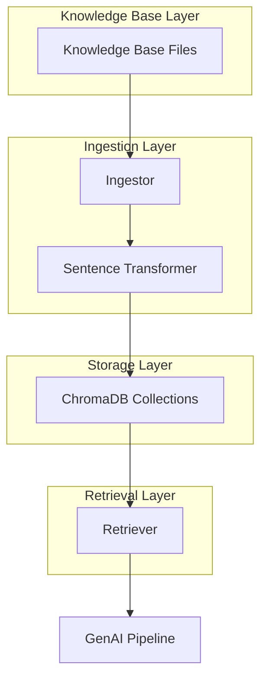

# Design Document: AutoForge RAG Knowledge Base

## Overview

The AutoForge RAG Knowledge Base is an offline-first retrieval system that provides automotive domain knowledge to GenAI pipelines for Software Defined Vehicle (SDV) development. The system ingests three types of automotive documents (VSS signals, MISRA-C++ rules, ASPICE checklists), creates semantic embeddings using a local transformer model, stores them in a persistent vector database, and provides efficient retrieval functions for context injection into LLM prompts.

The design prioritizes offline operation, data integrity, and ease of integration with existing GenAI workflows. By using sentence-transformers and ChromaDB, the system avoids external API dependencies while maintaining high-quality semantic search capabilities.

## Architecture

The system follows a three-layer architecture:

1. **Knowledge Base Layer**: Static document storage containing automotive domain knowledge in structured formats (JSON for VSS, Markdown for MISRA/ASPICE)

2. **Ingestion Layer**: Document processing pipeline that loads, chunks, embeds, and persists knowledge into ChromaDB collections

3. **Retrieval Layer**: Query interface that performs semantic search across collections and formats results for LLM consumption



The architecture ensures separation of concerns: ingestion can be run independently to update the knowledge base, while retrieval operates on the persisted database without re-processing documents.

## Components and Interfaces

### Ingestor Component (`rag/ingestor.py`)

**Responsibilities:**
- Load documents from knowledge_base/ directory
- Chunk documents appropriately for each format type
- Generate embeddings using sentence-transformers
- Store embedded chunks in ChromaDB with metadata
- Provide progress feedback during ingestion

**Key Functions:**

```python
def load_vss_signals(file_path: Path) -> List[Dict[str, Any]]:
    """Load VSS signals from JSON file"""
    
def load_markdown_document(file_path: Path) -> str:
    """Load markdown content from file"""
    
def chunk_vss_signals(signals: List[Dict]) -> List[str]:
    """Convert each signal object to text chunk"""
    
def chunk_markdown(content: str, chunk_size: int = 500, overlap: int = 50) -> List[str]:
    """Split markdown by headings or fixed size with overlap"""
    
def create_embeddings(texts: List[str], model_name: str = "all-MiniLM-L6-v2") -> List[List[float]]:
    """Generate embeddings using sentence-transformers"""
    
def store_in_chromadb(collection_name: str, chunks: List[str], embeddings: List[List[float]], db_path: Path):
    """Store chunks and embeddings in ChromaDB collection"""
    
def ingest_all_documents(knowledge_base_path: Path, db_path: Path):
    """Main ingestion function that processes all documents"""
```

**Interface Contract:**
- Input: File paths to knowledge base documents
- Output: Populated ChromaDB collections in data/chroma_db/
- Side Effects: Creates database directory if not exists, prints progress statements

### Retriever Component (`rag/retriever.py`)

**Responsibilities:**
- Initialize connection to persisted ChromaDB
- Execute semantic search queries across collections
- Format results for LLM prompt injection
- Provide clean API for external modules

**Key Functions:**

```python
class RAGRetriever:
    def __init__(self, db_path: Path):
        """Initialize retriever with ChromaDB connection"""
        
    def retrieve_context(self, query: str, top_k: int = 5) -> Dict[str, List[str]]:
        """Query all collections and return organized results
        
        Returns:
            {
                'vss_signals': [chunk1, chunk2, ...],
                'misra_rules': [chunk1, chunk2, ...],
                'aspice_items': [chunk1, chunk2, ...]
            }
        """
        
    def build_prompt_context(self, query: str, top_k: int = 5) -> str:
        """Format retrieved context as clean string for LLM prompt"""
```

**Interface Contract:**
- Input: Query string and optional top_k parameter
- Output: Dictionary of relevant chunks organized by document type, or formatted string
- No side effects: Read-only operations on database

### ChromaDB Collections

**Collection Schema:**

Each collection stores:
- `ids`: Unique identifiers for chunks
- `documents`: Text content of chunks
- `embeddings`: Vector representations (384 dimensions for all-MiniLM-L6-v2)
- `metadatas`: Optional metadata (source file, chunk index, etc.)

**Collections:**
1. `vss_signals`: Vehicle signal definitions
2. `misra_rules`: MISRA-C++ coding rules
3. `aspice_checklist`: ASPICE process requirements

## Data Models

### VSS Signal Document Structure

```json
{
  "signal_name": "Vehicle.Speed",
  "datatype": "float",
  "unit": "km/h",
  "min_value": 0.0,
  "max_value": 250.0,
  "description": "Current vehicle speed measured by the speedometer."
}
```

**Chunking Strategy:** Each signal object becomes one text chunk formatted as:
```
Signal: Vehicle.Speed
Type: float
Unit: km/h
Range: 0.0 to 250.0
Description: Current vehicle speed measured by the speedometer.
```

### MISRA Rule Document Structure

```markdown
## Rule 8.4.1: Variable Initialization
All variables must be initialized before use. This prevents undefined behavior from uninitialized memory access.

## Rule 10.3.2: Type Casting
Explicit type casts must be used when converting between incompatible types. This ensures type safety and prevents implicit conversions.
```

**Chunking Strategy:** Split by heading (##) or every 500 characters with 50-character overlap to maintain context.

### ASPICE Checklist Document Structure

```markdown
- [ ] Requirements are uniquely identified and traceable to source
- [ ] Design documents describe architecture and component interfaces
- [ ] Code reviews are conducted with documented findings
```

**Chunking Strategy:** Split by heading or every 500 characters with 50-character overlap.

### Embedding Model

**Model:** sentence-transformers/all-MiniLM-L6-v2
- **Dimensions:** 384
- **Max Sequence Length:** 256 tokens
- **Performance:** ~14,000 sentences/second on CPU
- **Size:** ~80MB download
- **Offline:** Fully local after initial model download

### ChromaDB Storage

**Persistence:** SQLite-based storage in `data/chroma_db/`
**Distance Metric:** Cosine similarity (default for ChromaDB)
**Collections:** Separate collections for each document type to enable organized retrieval

## Correctness Properties

A property is a characteristic or behavior that should hold true across all valid executions of a system—essentially, a formal statement about what the system should do. Properties serve as the bridge between human-readable specifications and machine-verifiable correctness guarantees.

### Property 1: Signal Field Completeness

For any vehicle signal definition in vss_signals.json, the signal must include all required fields: signal_name, datatype, unit, min_value, max_value, and description.

**Validates: Requirements 1.2**

### Property 2: VSS Hierarchical Naming

For any vehicle signal definition, the signal_name must follow VSS hierarchical dot notation format (e.g., "Vehicle.Speed", "Vehicle.Chassis.Axle.Wheel.Tire.Pressure").

**Validates: Requirements 1.4**

### Property 3: Signal Description Length

For any vehicle signal definition, the description field must contain 1 to 2 sentences (validated by counting sentence-ending punctuation).

**Validates: Requirements 1.5**

### Property 4: MISRA Rule Structure

For any MISRA-C++ rule in misra_rules.md, the rule must include a rule ID, short title, and description.

**Validates: Requirements 2.2**

### Property 5: ASPICE Checkbox Format

For any ASPICE requirement in aspice_checklist.md, the item must be formatted as a markdown checkbox with an explanation.

**Validates: Requirements 3.2**

### Property 6: Signal Chunk Completeness

For any vehicle signal processed by the Ingestor, the resulting text chunk must contain the signal name, unit, range (min and max values), and description.

**Validates: Requirements 4.2**

### Property 7: Markdown Chunking Overlap

For any markdown content processed by the Ingestor with chunking enabled, consecutive chunks must have the specified overlap (50 characters by default), and no chunk should exceed the maximum size (500 characters by default) unless it contains an indivisible element.

**Validates: Requirements 4.3**

### Property 8: Retrieval Result Structure

For any query string passed to retrieve_context, the returned value must be a dictionary containing exactly three keys ('vss_signals', 'misra_rules', 'aspice_items'), and each key must map to a list of strings.

**Validates: Requirements 5.3, 5.4**

### Property 9: Prompt Context String Format

For any query string passed to build_prompt_context, the returned value must be a non-empty string.

**Validates: Requirements 5.7**

### Property 10: Signal Ingestion-Retrieval Round Trip

For any vehicle signal, if the signal is ingested into ChromaDB and then retrieved using its exact signal_name as the query, the retrieved chunk must contain all original signal fields (signal_name, datatype, unit, min_value, max_value, description).

**Validates: Requirements 8.1, 8.2**

### Property 11: MISRA Rule Ingestion-Retrieval Round Trip

For any MISRA-C++ rule, if the rule is ingested into ChromaDB and then retrieved using its rule ID as the query, the retrieved chunk must contain the rule ID, title, and description.

**Validates: Requirements 8.3**

### Property 12: ASPICE Item Ingestion-Retrieval Round Trip

For any ASPICE checklist item, if the item is ingested into ChromaDB and then retrieved, the retrieved chunk must preserve the checkbox format and explanation text.

**Validates: Requirements 8.4**

## Error Handling

### File Loading Errors

**Scenario:** Knowledge base files are missing or corrupted
**Handling:**
- Check file existence before loading using `Path.exists()`
- Catch `FileNotFoundError` and provide clear error message indicating which file is missing
- Catch `json.JSONDecodeError` for malformed JSON and indicate the file path
- Catch `UnicodeDecodeError` for encoding issues and suggest UTF-8 encoding

**Example:**
```python
try:
    with open(file_path, 'r', encoding='utf-8') as f:
        data = json.load(f)
except FileNotFoundError:
    raise FileNotFoundError(f"Knowledge base file not found: {file_path}")
except json.JSONDecodeError as e:
    raise ValueError(f"Invalid JSON in {file_path}: {e}")
```

### Embedding Model Errors

**Scenario:** Sentence-transformers model fails to load or download
**Handling:**
- Catch model loading exceptions and provide clear error message
- Suggest checking internet connectivity for first-time model download
- Verify model cache directory permissions

**Example:**
```python
try:
    model = SentenceTransformer('all-MiniLM-L6-v2')
except Exception as e:
    raise RuntimeError(f"Failed to load embedding model: {e}. "
                      "Ensure internet connectivity for first download.")
```

### ChromaDB Errors

**Scenario:** Database initialization or persistence fails
**Handling:**
- Create database directory if it doesn't exist using `Path.mkdir(parents=True, exist_ok=True)`
- Catch permission errors and suggest checking directory write permissions
- Catch database corruption errors and suggest re-running ingestion

**Example:**
```python
db_path.mkdir(parents=True, exist_ok=True)
try:
    client = chromadb.PersistentClient(path=str(db_path))
except Exception as e:
    raise RuntimeError(f"Failed to initialize ChromaDB at {db_path}: {e}")
```

### Query Errors

**Scenario:** Retrieval queries fail or return no results
**Handling:**
- Return empty lists for collections with no matches (graceful degradation)
- Validate query string is non-empty before processing
- Catch ChromaDB query exceptions and provide meaningful error messages

**Example:**
```python
if not query.strip():
    raise ValueError("Query string cannot be empty")

try:
    results = collection.query(query_texts=[query], n_results=top_k)
except Exception as e:
    logger.error(f"Query failed for collection {collection.name}: {e}")
    return []
```

### Data Validation Errors

**Scenario:** Knowledge base documents have missing or invalid fields
**Handling:**
- Validate required fields exist before processing
- Skip malformed entries with warning rather than failing entire ingestion
- Log validation errors for debugging

**Example:**
```python
required_fields = ['signal_name', 'datatype', 'unit', 'min_value', 'max_value', 'description']
for signal in signals:
    missing = [f for f in required_fields if f not in signal]
    if missing:
        logger.warning(f"Signal missing fields {missing}: {signal.get('signal_name', 'unknown')}")
        continue
```

## Testing Strategy

### Dual Testing Approach

The testing strategy employs both unit tests and property-based tests to ensure comprehensive coverage:

- **Unit tests** verify specific examples, edge cases, error conditions, and integration points between components
- **Property tests** verify universal properties across all inputs using randomized test data
- Together, they provide complementary coverage: unit tests catch concrete bugs in specific scenarios, while property tests verify general correctness across the input space

### Property-Based Testing

**Library:** Hypothesis (Python property-based testing library)

**Configuration:**
- Minimum 100 iterations per property test to ensure adequate randomization coverage
- Each property test must include a comment tag referencing the design document property
- Tag format: `# Feature: autoforge-rag-knowledge-base, Property {number}: {property_text}`

**Property Test Examples:**

```python
from hypothesis import given, strategies as st

# Feature: autoforge-rag-knowledge-base, Property 1: Signal Field Completeness
@given(st.data())
def test_signal_field_completeness(data):
    """For any vehicle signal definition, all required fields must be present"""
    signals = load_vss_signals(VSS_SIGNALS_PATH)
    signal = data.draw(st.sampled_from(signals))
    
    required_fields = ['signal_name', 'datatype', 'unit', 'min_value', 'max_value', 'description']
    for field in required_fields:
        assert field in signal, f"Signal missing required field: {field}"

# Feature: autoforge-rag-knowledge-base, Property 10: Signal Ingestion-Retrieval Round Trip
@given(st.data())
def test_signal_round_trip(data):
    """For any signal, ingesting then retrieving by name returns all original fields"""
    signals = load_vss_signals(VSS_SIGNALS_PATH)
    signal = data.draw(st.sampled_from(signals))
    
    # Ingest signal
    chunk = chunk_vss_signals([signal])[0]
    # ... store in test ChromaDB instance ...
    
    # Retrieve by signal name
    retriever = RAGRetriever(test_db_path)
    results = retriever.retrieve_context(signal['signal_name'], top_k=1)
    
    # Verify all fields present in retrieved chunk
    retrieved_chunk = results['vss_signals'][0]
    for field in ['signal_name', 'datatype', 'unit', 'min_value', 'max_value', 'description']:
        assert str(signal[field]) in retrieved_chunk
```

### Unit Testing

**Framework:** pytest

**Test Categories:**

1. **File Loading Tests**
   - Test loading valid JSON and markdown files
   - Test handling of missing files (FileNotFoundError)
   - Test handling of malformed JSON (JSONDecodeError)
   - Test handling of encoding issues

2. **Chunking Tests**
   - Test VSS signal to text chunk conversion
   - Test markdown splitting by headings
   - Test markdown splitting with 500 char limit and 50 char overlap
   - Test edge case: empty content
   - Test edge case: content shorter than chunk size

3. **Embedding Tests**
   - Test embedding generation produces correct dimensions (384)
   - Test embedding model loads successfully
   - Test batch embedding for multiple chunks

4. **ChromaDB Integration Tests**
   - Test database initialization and persistence
   - Test collection creation (vss_signals, misra_rules, aspice_checklist)
   - Test storing chunks with embeddings
   - Test database directory auto-creation

5. **Retrieval Tests**
   - Test retrieve_context returns correct dictionary structure
   - Test retrieve_context with various top_k values
   - Test build_prompt_context returns formatted string
   - Test retrieval with empty database returns empty lists
   - Test retrieval with non-existent query returns empty lists

6. **Integration Tests**
   - Test full ingestion pipeline (load → chunk → embed → store)
   - Test full retrieval pipeline (query → retrieve → format)
   - Test offline operation (no network calls)
   - Test relative path resolution with pathlib.Path

7. **Error Handling Tests**
   - Test graceful handling of missing knowledge base files
   - Test graceful handling of corrupted JSON
   - Test graceful handling of database permission errors
   - Test validation of empty query strings

**Example Unit Tests:**

```python
def test_load_vss_signals_success():
    """Test loading valid VSS signals JSON file"""
    signals = load_vss_signals(Path('knowledge_base/vss_signals.json'))
    assert len(signals) == 30
    assert all('signal_name' in s for s in signals)

def test_chunk_vss_signal_format():
    """Test VSS signal chunking includes all required information"""
    signal = {
        'signal_name': 'Vehicle.Speed',
        'datatype': 'float',
        'unit': 'km/h',
        'min_value': 0.0,
        'max_value': 250.0,
        'description': 'Current vehicle speed.'
    }
    chunk = chunk_vss_signals([signal])[0]
    
    assert 'Vehicle.Speed' in chunk
    assert 'float' in chunk
    assert 'km/h' in chunk
    assert '0.0' in chunk
    assert '250.0' in chunk
    assert 'Current vehicle speed.' in chunk

def test_retrieve_context_structure():
    """Test retrieve_context returns dictionary with three keys"""
    retriever = RAGRetriever(Path('data/chroma_db'))
    results = retriever.retrieve_context('vehicle speed')
    
    assert isinstance(results, dict)
    assert set(results.keys()) == {'vss_signals', 'misra_rules', 'aspice_items'}
    assert all(isinstance(v, list) for v in results.values())

def test_markdown_chunking_overlap():
    """Test markdown chunking maintains specified overlap"""
    content = "A" * 1000  # Long content
    chunks = chunk_markdown(content, chunk_size=500, overlap=50)
    
    # Verify overlap between consecutive chunks
    for i in range(len(chunks) - 1):
        chunk1_end = chunks[i][-50:]
        chunk2_start = chunks[i+1][:50]
        assert chunk1_end == chunk2_start
```

### Test Coverage Goals

- **Line Coverage:** Minimum 85% for all modules
- **Branch Coverage:** Minimum 80% for conditional logic
- **Property Coverage:** 100% of correctness properties must have corresponding property tests

### Continuous Testing

- Run unit tests on every code change
- Run property tests with 100 iterations in CI/CD pipeline
- Run integration tests with full ingestion and retrieval cycle
- Monitor test execution time (target: < 30 seconds for full suite)

