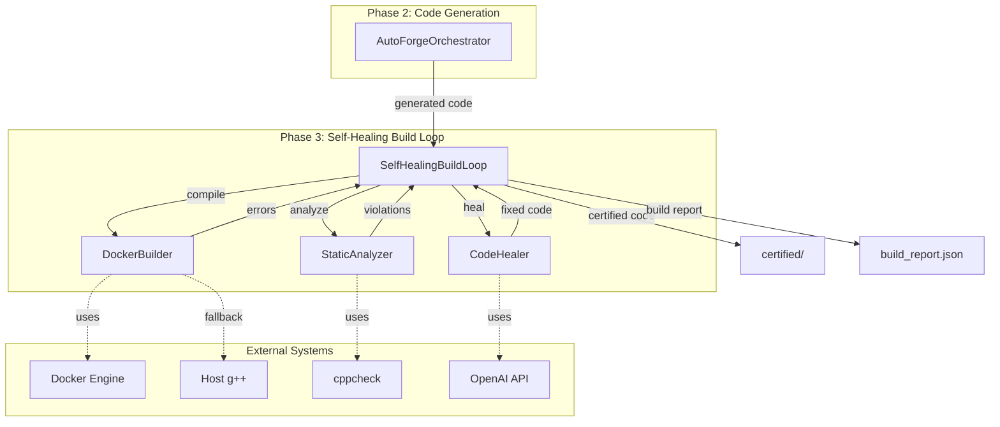
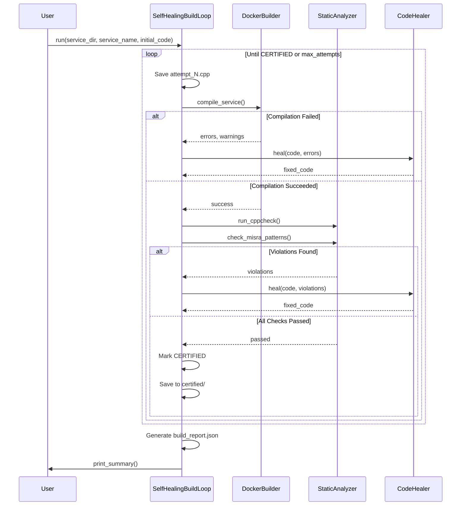

# Design Document: AutoForge Self-Healing Build Loop

## Overview

The Self-Healing Build Loop extends AutoForge Phase 2 with automated compilation, static analysis, and LLM-powered code correction capabilities. The system operates as a feedback loop: compile generated C++ code, analyze it for errors and MISRA violations, use an LLM to fix issues, and repeat until the code is certified or maximum attempts are reached.

The architecture consists of four main components:

1. **DockerBuilder**: Manages Docker image creation and containerized C++ compilation with automotive toolchains (gcc, g++, cmake, cppcheck). Falls back to host g++ when Docker is unavailable.

2. **StaticAnalyzer**: Runs cppcheck for comprehensive static analysis and performs custom MISRA-C++ pattern checking (malloc/free, goto, printf/scanf, multiple returns, NULL vs nullptr).

3. **CodeHealer**: Uses OpenAI's LLM to analyze compilation errors and static analysis violations, generating fixed code while preserving original logic.

4. **SelfHealingBuildLoop**: Orchestrates the entire workflow, managing state across attempts, saving intermediate versions, generating build reports, and certifying production-ready code.

The system integrates seamlessly with Phase 2's multi-agent code generation, creating an end-to-end pipeline from requirements to certified automotive embedded software.

## Architecture

### Component Diagram



### Workflow Sequence



## Components and Interfaces

### DockerBuilder

**Purpose**: Manages Docker-based C++ compilation with automotive toolchains and provides host fallback.

**Key Methods**:

```python
class DockerBuilder:
    def __init__(self, dockerfile_path: str = "docker/Dockerfile"):
        """Initialize with Docker availability detection."""
        
    def build_image(self) -> bool:
        """Build Docker image with automotive toolchains.
        Returns: True if successful
        Raises: Exception if build fails
        """
        
    def check_image_exists(self) -> bool:
        """Check if autoforge-builder:latest image exists.
        Returns: True if image exists, False otherwise
        """
        
    def compile_service(self, service_dir: str, service_name: str, 
                       attempt: int = 1) -> dict:
        """Compile C++ service in Docker or using host g++.
        
        Args:
            service_dir: Path to service directory
            service_name: Name of the service
            attempt: Current attempt number
            
        Returns:
            {
                'success': bool,
                'stdout': str,
                'stderr': str,
                'error_lines': List[str],
                'warning_lines': List[str],
                'attempt_number': int
            }
        """
        
    def _prepare_cmake(self, service_dir: str, service_name: str):
        """Substitute service name into CMakeLists.txt template."""
        
    def _parse_errors(self, stderr: str) -> Tuple[List[str], List[str]]:
        """Extract error and warning lines from compiler output."""
```

**Docker Image Specification** (docker/Dockerfile):
- Base: Ubuntu 22.04
- Tools: gcc, g++, cmake, make, cppcheck, python3
- Minimal installation with --no-install-recommends
- Working directory: /workspace

**CMake Template** (docker/CMakeLists.txt.template):
- CMake 3.10+
- C++14 standard
- Compiler flags: -Wall -Wextra -Werror
- Placeholder: {{SERVICE_NAME}}

**Fallback Behavior**:
- Detects Docker availability on initialization
- Falls back to host g++ with same flags (-std=c++14 -Wall -Wextra -Werror)
- Maintains consistent interface regardless of compilation method

### StaticAnalyzer

**Purpose**: Performs cppcheck static analysis and custom MISRA-C++ pattern checking.

**Key Methods**:

```python
class StaticAnalyzer:
    def run_cppcheck(self, service_dir: str, service_name: str) -> dict:
        """Run cppcheck on compiled service.
        
        Args:
            service_dir: Path to service directory
            service_name: Name of the service
            
        Returns:
            {
                'passed': bool,
                'violations': List[dict],
                'warnings': List[str],
                'raw_output': str
            }
        """
        
    def check_misra_patterns(self, code: str) -> dict:
        """Check for MISRA-C++ violations using pattern matching.
        
        Args:
            code: C++ source code as string
            
        Returns:
            {
                'passed': bool,
                'violations': List[dict],
                'warnings': List[str]
            }
        """
        
    def _detect_line_number(self, code: str, pattern: str, 
                           line_index: int) -> int:
        """Convert 0-indexed line to 1-indexed line number."""
```

**Violation Structure**:
```python
{
    'type': str,           # e.g., "MISRA: malloc/free usage"
    'line_number': int,    # 1-indexed line number
    'message': str,        # Detailed description
    'severity': str        # "error" or "warning"
}
```

**MISRA Patterns Checked**:
1. malloc/free usage (prefer new/delete)
2. goto statements (forbidden)
3. printf/scanf usage (unsafe for embedded)
4. Multiple return statements (single exit point)
5. NULL usage (prefer nullptr in C++14)

### CodeHealer

**Purpose**: Uses OpenAI LLM to fix compilation errors and static analysis violations.

**Key Methods**:

```python
class CodeHealer:
    def __init__(self, api_key: str):
        """Initialize with OpenAI API key."""
        
    def heal(self, original_code: str, build_errors: List[str] = None,
             misra_violations: List[dict] = None, attempt: int = 1) -> dict:
        """Fix code issues using LLM.
        
        Args:
            original_code: Original C++ code
            build_errors: List of compilation errors
            misra_violations: List of MISRA violation dicts
            attempt: Current attempt number
            
        Returns:
            {
                'success': bool,
                'fixed_code': str,
                'attempt': int,
                'errors_addressed': List[str],
                'error_message': str  # Only if success=False
            }
        """
        
    def extract_code(self, response: str) -> str:
        """Extract C++ code from LLM response.
        
        Handles markdown code fences (```cpp) and raw code.
        """
        
    def _construct_prompt(self, original_code: str, build_errors: List[str],
                         misra_violations: List[dict], attempt: int) -> str:
        """Build healing prompt for LLM."""
```

**Prompt Strategy**:
- Role: C++ expert fixing automotive embedded code
- Instructions: Fix ALL issues, preserve logic, return raw C++ only
- Context: Original code, all errors/violations, attempt number
- Constraints: No markdown, no explanations, no logic changes

### SelfHealingBuildLoop

**Purpose**: Orchestrates the complete build, analyze, heal, certify workflow.

**Key Methods**:

```python
class SelfHealingBuildLoop:
    def __init__(self, builder: DockerBuilder, analyzer: StaticAnalyzer,
                 healer: CodeHealer, max_attempts: int = 3):
        """Initialize with component dependencies."""
        
    def run(self, service_dir: str, service_name: str, 
            initial_code: str) -> dict:
        """Execute self-healing build loop.
        
        Args:
            service_dir: Output directory for service
            service_name: Name of the service
            initial_code: Generated C++ code from Phase 2
            
        Returns:
            {
                'service_name': str,
                'final_status': str,  # CERTIFIED, FAILED, MAX_ATTEMPTS_REACHED
                'total_attempts': int,
                'attempts': List[dict],
                'certification_timestamp': str,  # ISO 8601, if certified
                'final_code_path': str
            }
        """
        
    def print_summary(self, build_report: dict):
        """Display human-readable build summary with emojis."""
        
    def _save_attempt(self, service_dir: str, service_name: str,
                     code: str, attempt: int):
        """Save intermediate code version."""
        
    def _certify_code(self, service_dir: str, service_name: str,
                     code: str, total_attempts: int):
        """Create certified/ directory with final code and certificate."""
        
    def _generate_report(self, service_dir: str, service_name: str,
                        attempts_history: List[dict], final_status: str,
                        total_attempts: int) -> dict:
        """Generate and save build_report.json."""
```

**State Management**:
- `current_attempt`: Counter starting at 1
- `current_code`: Code being processed in current iteration
- `attempts_history`: List of all attempt details for reporting

**Loop Logic**:
1. Write current code to [service_name].cpp
2. Save to [service_name]_attempt_N.cpp
3. Compile with DockerBuilder
4. If compilation fails: heal and continue loop
5. If compilation succeeds: run static analysis
6. If violations found: heal and continue loop
7. If all checks pass: certify and exit loop
8. If max_attempts reached: exit with failure status

## Data Models

### Build Report Structure

```json
{
  "service_name": "TyrePressureMonitor",
  "final_status": "CERTIFIED",
  "total_attempts": 2,
  "max_attempts": 3,
  "attempts": [
    {
      "attempt_number": 1,
      "compilation_success": false,
      "compilation_errors": [
        "error: 'cout' was not declared in this scope"
      ],
      "compilation_warnings": [],
      "static_analysis_passed": null,
      "static_analysis_violations": [],
      "healing_applied": true,
      "errors_addressed": [
        "Missing iostream include",
        "Missing std:: namespace"
      ],
      "code_file_path": "outputs/TyrePressureMonitor_attempt_1.cpp"
    },
    {
      "attempt_number": 2,
      "compilation_success": true,
      "compilation_errors": [],
      "compilation_warnings": [],
      "static_analysis_passed": true,
      "static_analysis_violations": [],
      "healing_applied": false,
      "errors_addressed": [],
      "code_file_path": "outputs/TyrePressureMonitor_attempt_2.cpp"
    }
  ],
  "certification_timestamp": "2024-01-15T10:30:45.123456",
  "final_code_path": "outputs/certified/TyrePressureMonitor.cpp"
}
```

### Certification File Structure

**File**: certified/CERTIFIED.txt

```
=== CODE CERTIFICATION ===
Service: TyrePressureMonitor
Timestamp: 2024-01-15T10:30:45.123456
Total Attempts: 2

Code has passed compilation and static analysis checks.
This code is ready for production deployment.
```

### Attempt History Entry

```python
{
    'attempt_number': int,
    'compilation_success': bool,
    'compilation_errors': List[str],
    'compilation_warnings': List[str],
    'static_analysis_passed': bool | None,  # None if compilation failed
    'static_analysis_violations': List[dict],
    'healing_applied': bool,
    'errors_addressed': List[str],
    'code_file_path': str
}
```


## Correctness Properties

*A property is a characteristic or behavior that should hold true across all valid executions of a system-essentially, a formal statement about what the system should do. Properties serve as the bridge between human-readable specifications and machine-verifiable correctness guarantees.*

### Property 1: Compiler Output Parsing

*For any* compiler stderr output containing error or warning messages, the DockerBuilder SHALL correctly identify and extract all lines containing "error:" as error_lines and all lines containing "warning:" as warning_lines, preserving the original formatting.

**Validates: Requirements 4.8, 6.1, 6.2**

### Property 2: Compilation Output Format Consistency

*For any* service compilation (whether using Docker or fallback mode), the DockerBuilder SHALL return a dictionary with the same structure containing success, stdout, stderr, error_lines, warning_lines, and attempt_number fields.

**Validates: Requirements 5.5**

### Property 3: MISRA Pattern Detection

*For any* C++ code string, the StaticAnalyzer.check_misra_patterns method SHALL detect all occurrences of forbidden patterns (malloc/free, goto, printf/scanf, multiple returns, NULL) and return passed=False if any violations are found, passed=True otherwise.

**Validates: Requirements 8.2, 8.3, 8.4, 8.5, 8.6, 8.8**

### Property 4: MISRA Violation Structure

*For any* detected MISRA violation, the StaticAnalyzer SHALL create a violation dictionary containing type, line_number, message, and severity fields with appropriate values.

**Validates: Requirements 8.7, 26.1, 26.2, 26.3, 26.4**

### Property 5: Code Extraction from LLM Response

*For any* LLM response string (with or without markdown code fences), the CodeHealer.extract_code method SHALL extract the C++ code content, strip markdown delimiters (```cpp or ```), remove leading/trailing whitespace, and return clean code.

**Validates: Requirements 9.7, 10.2, 10.3, 10.5**

### Property 6: Attempt File Persistence

*For any* build attempt N, the SelfHealingBuildLoop SHALL save the code version to a file named [service_name]_attempt_N.cpp in the service directory, where N is the attempt number starting from 1.

**Validates: Requirements 11.9, 12.1**

### Property 7: Build Report Structure Completeness

*For any* completed build loop execution, the generated build_report.json SHALL contain all required fields: service_name, final_status, total_attempts, max_attempts, attempts array, and final_code_path, with each attempt entry containing attempt_number, compilation_success, compilation_errors, static_analysis_passed, static_analysis_violations, healing_applied, errors_addressed, and code_file_path.

**Validates: Requirements 13.2, 13.3, 13.4, 13.5, 13.6, 13.9**

### Property 8: CMake Template Substitution

*For any* service name, the DockerBuilder SHALL replace all occurrences of {{SERVICE_NAME}} in the CMakeLists.txt.template with the actual service name when preparing compilation.

**Validates: Requirements 21.2**

### Property 9: Healing Prompt Completeness

*For any* healing request with build errors and/or MISRA violations, the CodeHealer SHALL construct a prompt that includes the original code and all error messages and violation details.

**Validates: Requirements 23.2, 23.3**

### Property 10: Line Number Detection Accuracy

*For any* C++ code with MISRA violations, the StaticAnalyzer SHALL identify the correct 1-indexed line number for each violation (malloc/free, goto, printf/scanf, return statements, NULL usage).

**Validates: Requirements 29.1, 29.2, 29.3, 29.4, 29.5, 29.6**

### Property 11: Healing Effectiveness Tracking

*For any* healing attempt, the CodeHealer SHALL return an errors_addressed list containing descriptions of all build errors and MISRA violations that were targeted for fixing.

**Validates: Requirements 27.1, 27.2, 27.3, 27.4**

## Error Handling

### Compilation Errors

**Docker Unavailability**:
- Detection: Execute `docker --version` on initialization
- Fallback: Use host g++ compiler with identical flags
- User notification: Print warning message about fallback mode

**Docker Build Failures**:
- Capture: Extract error message from docker build stderr
- Response: Raise exception with descriptive error message
- Recovery: User must fix Dockerfile or Docker installation

**Compilation Timeouts**:
- Enforcement: 60-second timeout on all compilation processes
- Detection: Catch subprocess.TimeoutExpired exception
- Response: Terminate process, return success=False with timeout message

**Missing Template Files**:
- Detection: Check CMakeLists.txt.template existence before reading
- Response: Raise FileNotFoundError with clear message
- Recovery: User must provide template file

### Static Analysis Errors

**Cppcheck Unavailability**:
- Detection: Catch FileNotFoundError when executing cppcheck
- Response: Return error message indicating cppcheck not installed
- Recovery: User must install cppcheck or skip static analysis

**Cppcheck Timeouts**:
- Enforcement: 60-second timeout on cppcheck execution
- Response: Return passed=False with timeout message
- Recovery: Increase timeout or simplify code

**Pattern Detection Failures**:
- Robustness: Use try-except around regex operations
- Response: Log warning and continue with other patterns
- Recovery: Automatic - partial results still useful

### LLM Healing Errors

**OpenAI API Failures**:
- Detection: Catch exceptions from OpenAI client
- Response: Return success=False with error message
- Recovery: Retry with exponential backoff (future enhancement)

**Invalid API Key**:
- Detection: Catch authentication errors
- Response: Return clear error message about API key
- Recovery: User must provide valid API key in .env

**Code Extraction Failures**:
- Robustness: Fallback to treating entire response as code
- Response: Log warning about unexpected format
- Recovery: Automatic - use raw response

**Empty or Invalid Responses**:
- Detection: Check if extracted code is empty or unchanged
- Response: Log warning and mark healing as failed
- Recovery: Continue to next attempt with original code

### Build Loop Errors

**Max Attempts Exceeded**:
- Detection: Counter reaches max_attempts value
- Response: Set final_status to "MAX_ATTEMPTS_REACHED"
- Recovery: User must manually fix code or increase max_attempts

**File I/O Errors**:
- Detection: Catch IOError/OSError when writing files
- Response: Raise exception with file path and error details
- Recovery: User must fix permissions or disk space

**State Corruption**:
- Prevention: Validate state after each attempt
- Detection: Check for None values or empty required fields
- Response: Raise exception with state details
- Recovery: Restart build loop from beginning

### Subprocess Error Handling Strategy

All subprocess calls wrapped in comprehensive error handling:

```python
try:
    result = subprocess.run(cmd, timeout=60, capture_output=True)
except subprocess.TimeoutExpired:
    return {'success': False, 'error': 'Timeout exceeded'}
except subprocess.CalledProcessError as e:
    return {'success': False, 'error': f'Command failed: {e.stderr}'}
except FileNotFoundError:
    return {'success': False, 'error': 'Command not found'}
```

## Testing Strategy

### Dual Testing Approach

The testing strategy employs both unit tests and property-based tests to ensure comprehensive coverage:

**Unit Tests**: Focus on specific examples, edge cases, error conditions, and integration points between components. Unit tests verify concrete scenarios and ensure components interact correctly.

**Property Tests**: Verify universal properties across all inputs using randomized test data. Property tests ensure correctness holds for the entire input space, not just hand-picked examples.

Together, these approaches provide complementary coverage: unit tests catch concrete bugs in specific scenarios, while property tests verify general correctness across the input domain.

### Property-Based Testing Configuration

**Library**: Use `hypothesis` for Python property-based testing

**Configuration**: Each property test SHALL run a minimum of 100 iterations to ensure adequate randomization coverage

**Tagging**: Each property test SHALL include a comment tag referencing the design document property:
```python
# Feature: autoforge-self-healing-build, Property 1: Compiler Output Parsing
@given(stderr_output=text())
def test_compiler_output_parsing(stderr_output):
    ...
```

### Unit Test Coverage

**DockerBuilder Tests**:
- Docker image build success/failure scenarios
- Image existence checking
- CMake template substitution with various service names
- Docker vs fallback mode selection
- Compilation timeout enforcement
- Error/warning line extraction from various compiler outputs
- Subprocess error handling (CalledProcessError, TimeoutExpired, FileNotFoundError)

**StaticAnalyzer Tests**:
- Cppcheck execution with correct flags
- Cppcheck output parsing
- Each MISRA pattern detection (malloc/free, goto, printf/scanf, multiple returns, NULL)
- Line number detection accuracy
- Violation dictionary structure
- Empty code handling
- Timeout enforcement

**CodeHealer Tests**:
- Prompt construction with errors only
- Prompt construction with violations only
- Prompt construction with both errors and violations
- Code extraction from markdown fenced responses
- Code extraction from raw code responses
- OpenAI API call success/failure
- Empty response handling
- API key validation

**SelfHealingBuildLoop Tests**:
- Initial code file writing
- Attempt file naming and persistence
- Compilation failure → healing workflow
- Static analysis failure → healing workflow
- Successful certification workflow
- Max attempts termination
- Build report generation with all fields
- Certification file creation
- Final code persistence
- State management across attempts

**Integration Tests**:
- Full pipeline: Phase 2 generation → Phase 3 build loop
- End-to-end certification of valid code
- End-to-end failure handling of invalid code
- Docker + fallback mode switching
- Multiple healing iterations

### Property Test Specifications

**Property 1: Compiler Output Parsing**
- Generate: Random stderr strings with embedded "error:" and "warning:" lines
- Verify: All error lines extracted, all warning lines extracted, formatting preserved
- Iterations: 100

**Property 2: Compilation Output Format Consistency**
- Generate: Random compilation scenarios (Docker/fallback, success/failure)
- Verify: Return dictionary always contains required keys with correct types
- Iterations: 100

**Property 3: MISRA Pattern Detection**
- Generate: Random C++ code with and without MISRA violations
- Verify: All violations detected, passed=False when violations exist, passed=True otherwise
- Iterations: 100

**Property 4: MISRA Violation Structure**
- Generate: Random C++ code with various MISRA violations
- Verify: Each violation dict contains type, line_number, message, severity fields
- Iterations: 100

**Property 5: Code Extraction from LLM Response**
- Generate: Random LLM responses with various markdown formats
- Verify: Code extracted correctly, markdown stripped, whitespace trimmed
- Iterations: 100

**Property 6: Attempt File Persistence**
- Generate: Random attempt numbers and service names
- Verify: File created with correct name pattern [service_name]_attempt_N.cpp
- Iterations: 100

**Property 7: Build Report Structure Completeness**
- Generate: Random build loop executions with varying outcomes
- Verify: Report contains all required fields with correct types and values
- Iterations: 100

**Property 8: CMake Template Substitution**
- Generate: Random service names (including edge cases with special characters)
- Verify: All {{SERVICE_NAME}} occurrences replaced correctly
- Iterations: 100

**Property 9: Healing Prompt Completeness**
- Generate: Random combinations of build errors and MISRA violations
- Verify: Prompt includes original code and all error/violation details
- Iterations: 100

**Property 10: Line Number Detection Accuracy**
- Generate: Random C++ code with violations at known line numbers
- Verify: Detected line numbers match actual violation locations (1-indexed)
- Iterations: 100

**Property 11: Healing Effectiveness Tracking**
- Generate: Random healing requests with various errors/violations
- Verify: errors_addressed list contains entries for all provided issues
- Iterations: 100

### Test Data Generators

**C++ Code Generator**:
- Valid C++ with/without MISRA violations
- Invalid C++ with syntax errors
- Edge cases: empty code, single line, very long files

**Compiler Output Generator**:
- Valid error messages with line numbers
- Valid warning messages
- Mixed error/warning output
- Empty output

**LLM Response Generator**:
- Markdown fenced code (```cpp)
- Generic markdown fenced code (```)
- Raw code without fences
- Mixed text and code
- Empty responses

### Continuous Integration

**Pre-commit Hooks**:
- Run unit tests on changed files
- Run property tests on changed components
- Enforce code formatting (black, isort)

**CI Pipeline**:
- Run full unit test suite
- Run full property test suite (100 iterations each)
- Generate coverage report (target: >85%)
- Run integration tests
- Build Docker image
- Test Docker and fallback modes

**Performance Benchmarks**:
- Compilation time (Docker vs fallback)
- Static analysis time
- LLM healing response time
- Full build loop time (1, 2, 3 attempts)
